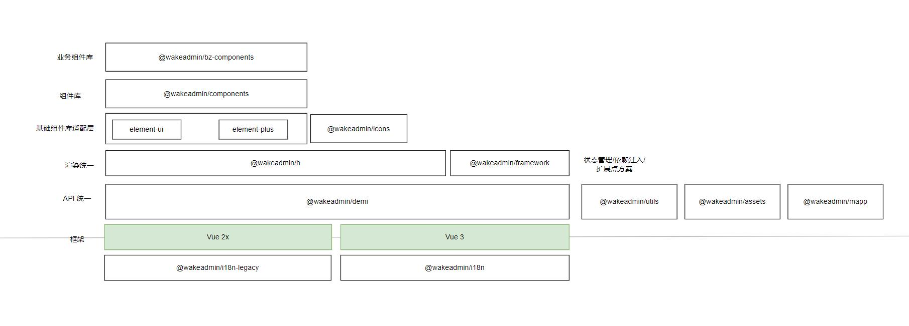

# 基础库矩阵图

 

 
 

- `@wakeadmin/framework`(<B name="@wakeadmin/framework" /><C/>): [依赖注入、扩展点、状态管理框架](./framework.md)
- `@wakeadmin/h`(<B name="@wakeadmin/h" /><C/>): 同时支持 Vue 2/3 的 JSX 库，旨在抹平 Vue 2/3 渲染层差异
- `@wakeadmin/i18n`/`@wakeadmin/i18n-legacy`(<B name="@wakeadmin/i18n" /> <C/>): [多语言支持](./i18n.md)
- `@wakeadmin/assets`(<B name="@wakeadmin/assets" /><C/>): 主要用于主题定制, [定义文案、静态资源的扩展点](../mapp/theme.md#如何定制文案图片等静态资源)
- `@wakeadmin/demi`(<B name="@wakeadmin/demi" /><C/>): vue-demi 的封装。为需要兼容 vue 2/3 的库提供统一的 API 出口。
- `@wakeadmin/icons`(<B name="@wakeadmin/icons" /><C/>)：[惟客图标库](../icons/index.md)
- `@wakeadmin/utils`(<B name="@wakeadmin/utils" /><C/>)：业务无关的工具库, 继承 [@wakeapp/utils](https://docs.wakedt.cn/master/utils)
- `@wakeadmin/theme`(<B name="@wakeadmin/theme" />): 惟客官方默认[主题包](../mapp/theme.md)
- `@wakeadmin/tailwind`(<B name="@wakeadmin/tailwind" />): 基于惟客默认主题扩展的[tailwind 配置预设](../tailwind/index.md)
- `@wakeadmin/mapp`(<B name="@wakeadmin/mapp" />): 微前端框架，基座就是基于它开发
- `@wakeadmin/vue-cli-plugin-i18n`(<B name="@wakeadmin/vue-cli-plugin-i18n" /><C/>): [i18n 语言包识别、合并插件](./i18n.md)
- `@wakeadmin/vue-cli-plugin-mapp`(<B name="@wakeadmin/vue-cli-plugin-mapp" />): 微前端基座插件
- `@wakeadmin/vue-cli-plugin-mapp-child`(<B name="@wakeadmin/vue-cli-plugin-mapp-child" /><C/>): [微前端子应用插件](../mapp/integration.md)
- `@wakeadmin/vue-cli-plugin-vendor`(<B name="@wakeadmin/vue-cli-plugin-vendor" /><C/>): 微前端[通用依赖共享插件](../mapp/advanced/vendors.md)
- `@wakeadmin/vue-cli-plugin-ce`(<B name="@wakeadmin/vue-cli-plugin-ce" />): Vue 自定义元素增强插件
- `@wakeadmin/transpiler`(<B name="@wakeadmin/transpiler" />): 微前端运行容器的转译器实现
- `@wakeadmin/services`(<B name="@wakeadmin/services" />): [前端接口服务](../mapp/advanced/services.md)
- `@wakeadmin/docker-build`(<B name="@wakeadmin/docker-build" />): [Docker 容器构建、发布、清理](./docker-build.md)
- `create-wakeadmin`(<B name="create-wakeadmin" />): [项目脚手架，可以快速创建子应用、主题包](./create-wakeadmin.md)
- `babel-preset-wakeadmin`(<B name="babel-preset-wakeadmin" /><C/>): 惟客 PC 端 babel 配置

 
 
 

# 仓库地址

 

- [wakeadmin/tools](http://gerrit.wakedata-inc.com/admin/repos/wakeadmin/tools) @wakeadmin 基础库
- [wakeadmin/terminal](http://gerrit.wakedata-inc.com/admin/repos/wakeadmin/terminal) 运行容器
- [wakeadmin/k8s-deploy](http://gerrit.wakedata-inc.com/admin/repos/wakeadmin/k8s-deploy) 一键部署模板
- [wakeadmin/doc](http://gerrit.wakedata-inc.com/admin/repos/wakeadmin/doc) 本文档仓库

 
 

# 镜像库

基础镜像:

- `wkfe/base`: 集成了 nginx + node 运行时的基础镜像
- `wkfe/mapp`：扩展 `wkfe/base` 用于微前端的运行容器
- `wkfe/mapp-child`： 子应用基础容器
- `wkfe/single`：扩展 `wkfe/base` 用于单页应用的运行容器

 

业务镜像:

- `wkfe/bay`: 扩展 `wkfe/mapp`, 惟客云标品基座

 

::: tip

- 子应用镜像, 建议使用 `wkfe/app-*` 形式命名
- 上述镜像时公开的, 子应用镜像由对应的业务团队维护。
- 内部 Harbor 也发布了上述镜像，可以加上 `172.26.59.200/` 前缀，比如 `172.26.59.200/wkfe/mapp`

:::

 
 
 

# 每日构建

 

基础库的发布频率：

- 内网[每日发布]

  - [wakeadmin/tools](http://gerrit.wakedata-inc.com/admin/repos/wakeadmin/tools) 
  - [wakeadmin/terminal](http://gerrit.wakedata-inc.com/admin/repos/wakeadmin/terminal)
    

   
   

- 外网每周发布一次
  - [wakeadmin/tools](http://gerrit.wakedata-inc.com/admin/repos/wakeadmin/tools) 
  - [wakeadmin/terminal](http://gerrit.wakedata-inc.com/admin/repos/wakeadmin/terminal) 
