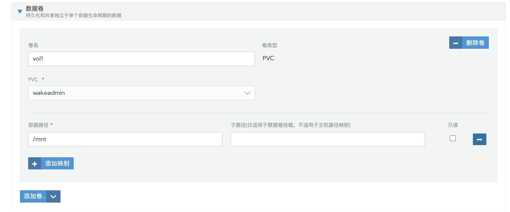
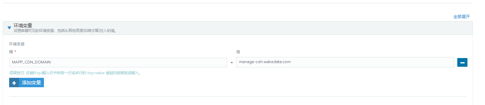
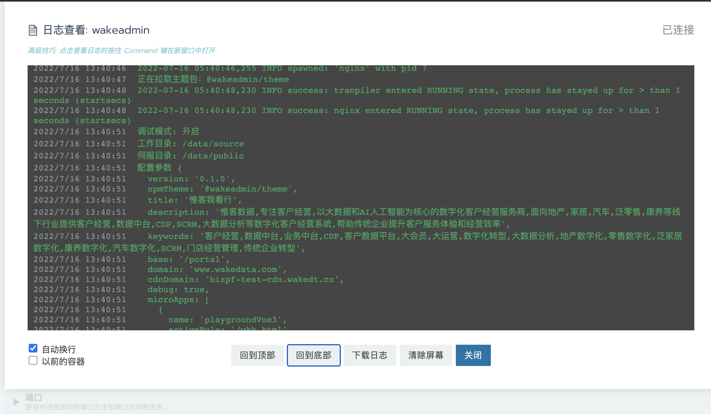

# 运行容器

<br>

[[toc]]

<br>
<br>

::: tip
关于运行容器的基本介绍已经在[部署](../deploy.md) 中提及，没有看的回去补一下。
:::

<br>
<br>

简单解释，`运行容器`就是一个模板引擎，负责对静态文件进行处理、转换、伺服。

<br>

## 目录规范

```shell
/data/
  /source/
    /__public__/             # 公共资源, 外部可以直接访问，不需要 __public__ 前缀
    /__config__/             # 配置目录
      config.yml
      any-sub-dir/
        my-config.yml

    /__entry__/              # 基座目录
      js/
      index.html

    /__apps__/               # 子应用目录
      wkb/
      dsp/
      dmp/
        js/
        mapp.json
        index.html

    /__i18n__/               # 语言包目录
      zh.tr
      en.tr
      any-sub-dir/
        zh.tr
        en.tr

    /__theme__/              # 主题目录
      config.yml
      element-ui.css
      element-plus.css
      fonts/
      i18n/
        zh.tr
        en.tr

  /public/                    # nginx 伺服目录
```

<br>

`/data/source` 下面可以根据自己的场景扩展其他目录，比如:

- `__vendors__` 通用 UMD 依赖

<br>
<br>

运行容器主要负责将 `/data/source` 目录下的文件(`__config__` 文件除外)，转换并拷贝到 `/data/public` 下， 而 `/data/public` 是 nginx 伺服的根目录。 因此，你放在 `/data/source` 下的静态资源，外部都能直接访问。

<br>
<br>
<br>
<br>

## 模板语法

`transpiler` 的模板引擎基于 [EJS](https://ejs.bootcss.com/)。只不过我们用于`自定义分隔符`, 使用了 `[% %]` 替换了默认的 `<% %>`。

<br>

使用案例:

<br>

```html
[% if (user) { %]
<h2>[%= user.name %]</h2>
[% } %]
```

<br>

### 基础标签含义

<br>

- `[% ` '脚本' 标签，用于流程控制，无输出。
- `[%_` 删除其前面的空格符
- `[%=` 输出数据到模板（输出是转义 HTML 标签）
- `[%-` 输出非转义的数据到模板
- `[%#` 注释标签，不执行、不输出内容
- `[%%` 输出字符串 '[%'
- `%] ` 一般结束标签
- `-%]` 删除紧随其后的换行符
- `_%]` 将结束标签后面的空格符删除

<br>
<br>

### 注释标签

`[% * %]` 这种语法在 HTML、JS、CSS 中都是非法的，那怎么绕过编译器的语法检查呢？

为了解决这个问题， `transpiler` 也提供了注释标签的语法：

- `<!—![% expression %]—>` 适合用于 `html` 模板注入, 避免语法问题
- `/*! [% expression %] */` 或者 `//! [% expression %]`。可以用于 JS 或 CSS 代码中，避免语法问题。

<br>

::: warning

注意，注释中的 `!` 是必须的，这可以避免被压缩器移除。

:::

<br>

::: tip

不过还是建议**只在 html 入口文件中使用模板**。CSS、JavaScript 文件被压缩器处理之后，行为难以预估。

:::

<br>
<br>
<br>

### 完整的模板示例

```html
<!DOCTYPE html>
<html lang="">
  <head>
    <meta charset="utf-8" />
    <meta http-equiv="X-UA-Compatible" content="IE=edge" />
    <meta name="viewport" content="width=device-width,initial-scale=1.0" />
    <meta name="description" content="[%= description %]" />
    <meta name="keywords" content="[%= keywords %]" />
    <link rel="icon" href="[%= assets.IMG_BAY_FAVICON || entryPath + '/favicon.png' %]" />
    <meta name="version" content="[%= version %]" />
    <meta name="update-time" content="[%= `${year}-${month}-${date}` %]" />
    <title>[%= title %]</title>
    <!-- 注入主题包 -->
    <!--! [%- theme.stylesheets.map(i => `<link rel="stylesheet" href="${i + '?' + hash }" />`).join('\n') %] -->
    <!--! [%- theme.scripts.map(i => `<script async="true" src="${i + '?' + hash}"></script>`).join('\n') %] -->

    <!--! [% if (microApps.length) { %] -->
    <!--! [%- 
      `<script>
        // 微应用注入
        (window.__MAPPS__ = (window.__MAPPS__ || [])).push(${microApps.map(i => JSON.stringify(i)).join(', ')});
      </script>`
    %] -->
    <!--! [% } %]-->

    <!--! [%- `<script>
      // 静态资源注入
      (window.__MAPP_ASSETS__ = (window.__MAPP_ASSETS__ || [])).push(${JSON.stringify(assets)});

      // 全局共享的语言包
      window.__I18N_BUNDLES__ = ${JSON.stringify(i18n)};
    </script>` %]
    -->
  </head>
  <body>
    <noscript>
      <strong
        >We're sorry but [%= title %] doesn't work properly without JavaScript enabled. Please enable it to
        continue.</strong
      >
    </noscript>
    <div id="app"></div>
    <!-- built files will be auto injected -->
  </body>
</html>
```

<br>

Webpack publicPath 示例:

```js
// vue.config.js
const { defineConfig } = require('@vue/cli-service');

module.exports = defineConfig({
  publicPath: process.env.NODE_ENV === 'production' ? '[%= publicPath %]' : '/',
});
```

::: tip
`vue-cli-plugin-mapp` 和 `vue-cli-plugin-mapp-child` 已默认配置，上面 publicPath 只做示例
:::

<br>
<br>
<br>

## 配置文件格式

<br>

配置文件的格式使用 [YAML 格式内容](https://www.runoob.com/w3cnote/yaml-intro.html)。比如:

```yaml
# config.yml
version: 0.1.0

base: '/'
domain: 'www.wakecloud.com'
cdnDomain: 'cdn.wakecloud.com'

debug: true
```

<br>

::: info
不支持 .json，因为很多前端静态资源是 json 文件，为了避免歧义。规定只用 `.yml`/`.yaml`
:::

<br>
<br>

## 配置来源

<br>

配置有几大来源：

1. `环境变量`。所有以 `MAPP_` 开头的环境变量都可以被识别。因为环境变量是字符串格式的，所以只能用来配置字符串类型的变量。`transpiler` 会将环境变量转换为驼峰式，比如 `MAPP_MY_CONFIG=hello` 最终会转换为 `{myConfig: 'hello'}`
2. `__config__` 配置目录下的 `.yml`、`.yaml`
3. `__theme__` 即主题包下的 `.yml`、`.yaml`

<br>
<br>

这些配置属性最终会合并到一起，合并的顺序是: 环境变量、`__theme__`、`__config__`。
也就是说环境变量的优先级最低、`__config__` 优先级最高.

<br>
<br>
<br>

## 设置配置文件合并优先级

<br>

YAML 配置文件也可以设置合并的优先级，默认优先级按照文件层级来设定, 比如：

```shell
config.yml                # order 0
  default/
    my-config.yml         # order 1
    some-dir/
      another-config.yml  # order 2
```

<br>

也就是说，**文件层级越高，优先级越高**。 你也可以在配置文件中显式设置 `order` 字段:

<br>

```yaml
# config-1.yml
order: 10

hello: 'one'
```

与

```yaml
# config-2.yml
order: 5

hello: 'two'
```

<br>

`config-1.yml` 优先级 `config-2.yml` 高，最终 `hello` 的值是 `one`

<br>
<br>
<br>
<br>

## 内置变量

<br>

### 基础变量

基础变量是开发者可以在环境变量、配置文件中配置的变量

<br>

| 变量名称                        | 描述                                                                               | 默认值                                                                           |
| ------------------------------- | ---------------------------------------------------------------------------------- | -------------------------------------------------------------------------------- |
| title?: string                  | 应用标题                                                                           | ''                                                                               |
| description?: string            | 应用描述, 可以用于 head.meta                                                       | ''                                                                               |
| keywords?: string               | 应用关键字，可以用于 head.meta                                                     | ''                                                                               |
| base?: string                   | 应用的基础路径, 比如 '/portal'                                                     | '/'                                                                              |
| domain?: string                 | 主域名，比如 `www.wakedata.com`, **:boom: 不要包含 http、// 协议前缀，以及路径**   | ''                                                                               |
| cdnDomain?: string              | CDN 域名，比如 `cdn.wakedata.com`, **:boom: 不要包含 http、// 协议前缀，以及路径** | ''                                                                               |
| npmTheme?: string               | npm 主题包, 指定包名， 比如 demo, demo@0.1.1                                       | 无                                                                               |
| npmRegistry?: string            | npm 镜像地址，默认为 npm 官方镜像。如果你的主题包来源于私有环境，需要指定这个字段  | 无                                                                               |
| debug?: boolean                 | 调试模式。如果开启，将输出更多日志，以及开启 `.map` 文件拷贝                       | false                                                                            |
| assets?: Record<string, string> | assets 资源映射, 详见 [布局与主题](../theme.md##如何定制文案、图片等静态资源？)    | {}                                                                               |
| version?: string                | 基座版本号。 基座的 `wkfe/mapp` 打包时会自动设置                                   | ''                                                                               |
| headInject?: string             | 注入模板到 `<head></head>` 下                                                      | ''                                                                               |
| bodyInject?: string             | 注入模板到 `<body></body>` 下                                                      | ''                                                                               |
| watch?: boolean                 | 开启监听模式                                                                       | [微前端基座](#创建微前端基座镜像)默认开启, [单应用模式](#创建单应用镜像)默认关闭 |

<br>
<br>

### 自动变量

自动变量是 transpiler 自动生成的，不能在配置文件中配置的变量。

| 变量名称                                                    | 描述                                                                               |
| ----------------------------------------------------------- | ---------------------------------------------------------------------------------- |
| microApps: [`MicroApp[]`](../integration.md#子应用描述信息) | 已注册的微应用，可以**手动配置**或者**自动发现**                                   |
| theme: `{ stylesheets: string[],scripts: string[]}`         | 主题包内容, stylesheets、scripts 包含的分别是样式文件、script 文件的 URL           |
| i18n: `{[locale: string]: string[]}`                        | 多语言包内容, key 为 locale， value 为语言包文件的的 URL                           |
| hash: string                                                | 唯一 hash，配置文件变动后会生成 hash， 可以用于缓存管理                            |
| timestamp: string                                           | 时间戳(毫秒)                                                                       |
| random: number                                              | 随机值                                                                             |
| year: number                                                | 年份                                                                               |
| month: number                                               | 月份                                                                               |
| date: number                                                | 日期                                                                               |
| **publicPath: string**                                      | 公共伺服路径, 可以用于设置 Webpack 的 publicPath, 例如 `//cdndomain.com/<baseUrl>` |
| themePath: string                                           | 主题路径, 例如 `/<baseUrl>/__theme__`                                              |
| i18nPath: string                                            | 语言包路径, 例如 `/<baseUrl>/__i18n__`                                             |
| entryPath: string                                           | 基座路径, 例如 `/<baseUrl>/__entry__`                                              |
| appsPath: string                                            | 子应用路径, 例如 `/<baseUrl>/__apps__`                                             |

<br>
<br>

::: info

**`微应用发现`**

`transpiler` 会搜索 `__apps__` 下的子目录，开发者也可以定义 `mapp.json` 来显式声明。

假设:

```shell
__apps__
  foo
  bar
    mapp.json
```

<br>

`foo` 没有定义 `mapp.json`, 将使用以下默认配置:

```json
{
  "name": "foo", // 默认按照目录命名
  "entry": "__apps__/foo",
  "activeRule": "/foo"
}
```

<br>

`bar` 定义了 `mapp.json`, transpiler 会将 mapp.json 合并到'默认配置'。

<br>

另外，`transpiler` 也支持在配置文件中配置 `microApps` 来覆盖上述自动发现的描述信息。

:::

<br>
<br>

::: info

**`主题包发现`**

<br>

`transpiler` 会发现 `__theme__` 下的`配置文件`、`语言包`。并将**顶层**的 CSS、JS 文件， 放入 `theme` 变量中。

:::

<br>
<br>

::: info

**`语言包发现`**

<br>

`transpiler` 会递归发现 `__theme__` 及 `__i18n__` 下的`*.tr` 文件， 并收集到 `i18n` 变量中。

:::

<br>
<br>

::: info

**`强制缓存失效`**

每次配置更新都会根据配置文件的内容生成一个新的 hash, 可以利用这个 hash 值来强制缓存失效。

如果子应用集成了 `@wakeadmin/vue-cli-plugin-child` 那么已经内置支持了，所有 chunk、filename 都会加上 `?[%= hash %]`。

<br>

:::

<br>
<br>
<br>

## 内置方法

| 名称                                                   | 描述                                                                           |
| ------------------------------------------------------ | ------------------------------------------------------------------------------ |
| `pathJoin(...p: string[]): string`                     | 路径连结                                                                       |
| `normalizePath(p: string): string`                     | 规范化路径，添加 '/' 前缀，并移除 '/' 后缀                                     |
| `removeHeadingSlash(p: string): string`                | 移除 '/'前缀                                                                   |
| `removeTrailingSlash(p: string): string`               | 移除 '/' 后缀                                                                  |
| `addHeadingSlash(p: string): string`                   |                                                                                |
| `addTrailingSlash(p: string): string`                  |                                                                                |
| `domainJoin(domain: string, path: string): string`     | 连结域名和路径。`domainJoin('example.com', 'hello') // => //example.com/hello` |
| `queryString(qs: object): string`                      | 序列化查询字符串 `queryString({ a: '1', b: '2' }) // => a=1&b=2`               |
| `queryJoin(url: string, qs: string \| object): string` | 连结 url 和查询字符串                                                          |
| `isEnabled(name): boolean`                             | 判断指定变量是否开启(true 或 'true')                                           |
| `isDisabled(name): boolean`                            | 判断指定变量是否开启(false 或 'false')                                         |

<br>
<br>
<br>

## 创建微前端基座镜像

创建微前端基座镜像很简单, 只需要继承 `wkfe/mapp` 然后将你的基座静态资源拷贝到 `data/source/__entry__` 即可:

```docker
FROM wkfe/mapp

WORKDIR /data
COPY ./dist  /data/source/__entry__

# 基座版本号
ENV MAPP_VERSION={{VERSION}}

# 默认主题包
ENV MAPP_NPM_THEME={{THEME}}
```

<br>

如上所示，除了放置基座静态资源，你也可以通过[环境变量](#配置来源)，或者按照[目录规范](#目录规范) `COPY` 文件(比如配置文件)到相应的目录。

<br>

如果有特殊的 nginx 配置需求，可以将 `*.conf` 放置到:

- `/data/under-http`: 放置在 `http{}` 下 include 的 nginx 配置
- `/data/under-server`: 放置在 `server{}` 下 include 的 nginx 配置

<br>
<br>

::: danger

注意，应该添加 `.dockerignore` 目录 node_modules 等目录, 否则会导致 Docker 拷贝整个 node_modules

:::

<br>
<br>

::: tip

微前端基座容器还提供了一些基础的接口服务， 详见 [基座接口服务](./services.md)

:::

<br>
<br>
<br>
<br>

## 创建微前端子应用镜像

微前端子应用就是一个纯粹的静态资源容器，在 Rancher 部署时，将对应的镜像拷入到 PVC 之后生命周期就结束了。

Dockerfile 示例:

```docker
FROM wkfe/mapp-child

# 将静态资源拷贝到 /data
COPY ./dist /data
```

<br>
<br>

Rancher Sidecar 配置示例, 按照约定， PVC `一定`要挂载到 `/mnt` 目录下:



<br>
<br>

为了避免不必要的拷贝(作为 sidecar 时，只要其中一个 sidecar 更新，所有 sidecar 都会进行拷贝).

`wkfe/mapp-child` 也支持缓存，你需要设置 `MAPP_CACHE_KEY` 环境变量。

```docker
FROM wkfe/mapp-child

ENV MAPP_CACHE_KEY=my-project-version

# 将静态资源拷贝到 /data
COPY ./dist /data
```

<br>
<br>

如果使用 [`@wakeadmin/docker-build`](../../base/docker-build.md), 那就更简单了:

```diff
+# Dockerfile.tpl <- 注意这里改成模板
FROM wkfe/mapp-child

-ENV MAPP_CACHE_KEY=my-project-version
+ENV MAPP_CACHE_KEY=<%= UUID %>

# 将静态资源拷贝到 /data
COPY ./dist /data
```

<br>
<br>
<br>
<br>

## 创建单应用镜像

运行容器也可以服务于微前端之外的场景，比如独立的前端单页应用。

Dockerfile 示例:

```docker
FROM wkfe/single # 注意这里时 single

# 拷贝静态资源到 __entry__ 目录
COPY ./dist  /data/source/__entry__
```

<br>
<br>

我们同样可以使用 `transpiler` 的能力。对于简单的配置场景，我们推荐在 Rancher 上使用`环境变量`来配置:



<br>
<br>
<br>
<br>

## 运行容器调试

### 调试模式

需要设置 `debug` 选项或者 `MAPP_DEBUG` 环境变量开启。开启后，将可以在控制台看到 transpiler 的运行日志：



<br>
<br>

### 调试 nginx

可以通过`执行命令行` 进入容器内部。nginx 配置通常位于 `/data/nginx.conf` 下，修改 nginx 文件之后，可以下列命令重启:

```shell
$ nginx -s reload
```

### 重启 transpiler

运行容器通过 [supervisor](http://supervisord.org) 管理 `transpiler` 和 `nginx` 进程

```shell
# 查看进程状态
$ supervisorctl status

# 重启 nginx
$ supervisorctl restart nginx

# 重启 transpiler
$ supervisorctl restart transpiler
```

当然，更简单的方式是重启容器。
