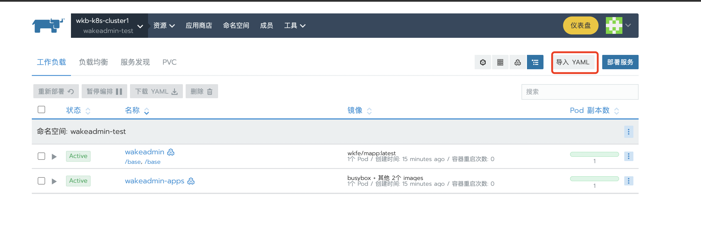

# 一键部署

::: tip

尝试 <a href="/k8s-deploy/index.html" target="_blank">图形化一键部署生成</a>

:::

 
 

得益于[运行容器](./container.md), 我们在部署阶段可以做更多事情，比如配置域名信息，注入脚本等。不再需要在代码中硬编码。
现在我们不再需要为不同的环境去编译不同的版本。
 
使得我们整个部署的过程可以实现标准化。

 
 
由于不同应用由不同的团队维护，在之前，构建一套完整闭环的应用，协调多个团队，人力和沟通成本都比较高。

 
 

标准化发布产物以及运行容器之后， `一键部署`能够在全新的环境，导入我们的部署配置，一键实现前端相关应用的部署。这个在 POC、创建开发环境/测试环境时非常有用。

## 预定义的配置

我们在 [`wakeadmin/k8s-deploy`](http://gitlab.wakedata.net/wakeadmin/k8s-deploy) 维护了标准化的 K8S 部署配置。开发者、运维人员只需要拷贝这些配置在 Rancher 上导入即可：

 

导入之后，再根据客户要求，修改`配置映射`、`负载均衡`等配置。

::: tip
master 分支为惟客云标品一键部署配置。行业标品、交付项目拉取独立分支维护自己的配置。命名规范:

- industry-\* 行业
- private-\* 私有化项目

:::

 

::: tip

应用容器版本号规范：

[按照惟客云产品版本号定义](http://www.wakedata-inc.com/pages/viewpage.action?pageId=20220351)

:::

 
 
 

## 扩展阅读

- [惟客后端一键部署模板](http://gitlab.wakedata.net/wake/ops/-/tree/master/Kubernetes)
- [云原生实战](https://www.yuque.com/leifengyang/oncloud)
- [K8S API](https://kubernetes.io/zh-cn/docs/reference/kubernetes-api/)
- [Rancher 用户指南](https://www.rancher.cn/docs/rancher2.5/k8s-in-rancher/_index)
