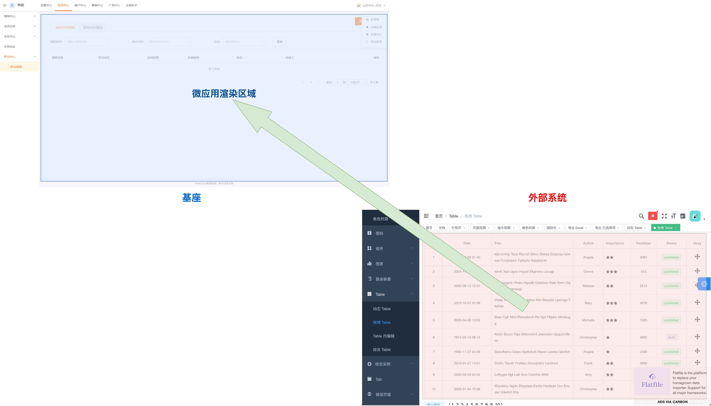
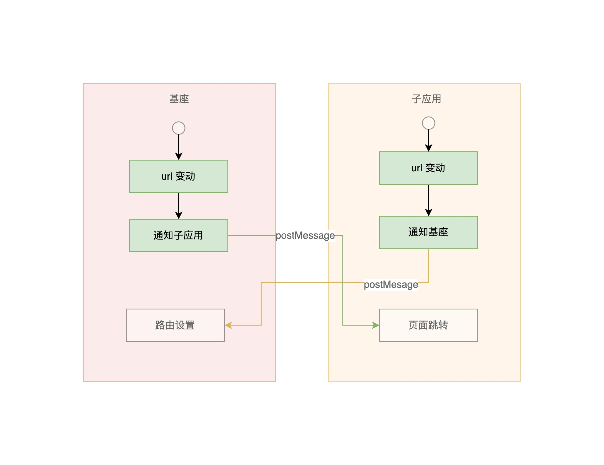

# 外部系统集成

<br>
<br>

[[toc]]

<br>
<br>

## 外部系统集成

<br>



<br>
<br>

外部系统集成到目前的微前端框架下，有两种方式:

- **iframe 集成**。传统的集成方式。这种情况可以创建一个子应用，负责管理 iframe, 比如维护会话信息、通信等等
- **微前端子应用集成**。 基座提供了很多[能力](../integration.md)，但是对于子应用来说都是可选的。对于外部系统而言，仅需少量改造, 就能集成进来。

<br>
<br>

::: warning

基座接管了导航菜单的渲染，因此不管是哪种集成方式, 外部子应用都需要

- 隐藏掉自身的菜单、导航组件框架
- 风格统一

:::

<br>

<br>

### 怎么选择？

<br>

`iframe`?:

- 优势

  - iframe 是浏览器原生支持的‘硬隔离’方案，可以完美隔离样式、Javascript
  - 兼容性好

- 劣势
  - 性能较差、用户体验也稍差。每次子应用进入都是一次浏览器上下文重建、资源重新加载的过程。
  - URL 不同步。需要额外的基座/子应用通信来保持 url 和菜单的联动。
  - 弹框类的功能无法应用到整个大应用中，只能在对应的 iframe 窗口内展示。
  - 状态、会话、样式无法共享。成也是隔离，败也是隔离，iframe 最大的问题也在于他的隔离性无法被突破。 需要额外的通信、或其他复杂手段才能做到。

<br>
<br>

`微前端子应用集成`?:

- 优势
  - 解决了 iframe 的一些劣势，性能和体验都不错。同时也能保证应用的隔离性。
  - 支持共享状态、样式、会话、依赖等等
- 劣势
  - 基座和子应用在同一 DOM 树下渲染，需要避免子应用污染基座, 有一些适配工作。
  - 子应用静态资源拉取需要支持跨域

<br>

- 不适用的场景
  - 本身就是巨石应用，系统比较庞大。
  - 应用服务于多个系统，很难只针对我们特定修改。只能是我们主动对接的场景

<br>

<br>

<br>
<br>

### 1. iframe 集成

<br>

创建子应用，以 Vue 3 为例子：

创建路由：

```js
import { createRouter, createWebHashHistory } from 'vue-router';
import ExternalIntergration from './ExternalIntergration';

const router = createRouter({
  // 使用 hash
  history: createWebHashHistory(),
  routes: [
    {
      // 匹配所有路由
      path: '/:any*',
      component: ExternalIntergration,
    },
  ],
});
```

<br>
<br>

iframe 包裹：

```html
<template>
  <iframe :src="target"></iframe>
</template>

<script>
  import { defineComponent, computed } from 'vue';
  import { useRoute } from 'vue-router';

  export default defineComponent(() => {
    const route = useRoute();
    const target = computed(() => {
      // 封装外部系统链接，可以在这里传入路由、鉴权信息
      return `https://wakeadmin.wakefe.top?token=${token}#${route.fullPath}`;
    });

    return { target };
  });
</script>
```

<br>

上述的方案，可以用于简单的集成场景。它有以下确定：

- 采用了基座到子应用路由的单向联动，子应用内部路由跳转不会响应到基座
- 直接设置 iframe src 会导致强刷，性能和体验差。

<br>
<br>

因此需要基座需要额外的通信来保持菜单和路由的联动:



<br>
<br>

挂载应用：

<br>
<br>

```js
import { createApp } from 'vue';
import App from './App.vue';
import router from './router';
import bay from '@wakeadmin/bay';

let app;

bay.createMicroApp({
  async mount(props) {
    app = createApp(App);
    app.use(router);
    app.mount(props.container ? props.container.querySelector('#app') : '#app');
  },

  async unmount(props) {
    app.unmount();
  },
});
```

<br>
<br>

<br>
<br>

最后参照 [部署](../deploy.md) 进行部署就可以了。

<br>
<br>
<br>
<br>

### 2. 最小化改造集成到基座

<br>
<br>

调整应用挂载方式：

```js
import { createApp } from 'vue';
import App from './App.vue';
import router from './router';

const APP_NAME = 'APP_NAME'; // 必须唯一
let app;

async function bootstrap() {
  console.log('bootstraped');
}

async function mount(props) {
  app = createApp(App);
  app.use(router);
  app.mount(props.container ? props.container.querySelector('#app') : '#app');
}

async function unmount(props) {
  app.unmount();
}

async function update(props) {
  console.log('update props', props);
}

window[APP_NAME] = {
  bootstrap,
  mount,
  unmount,
  update,
};

// 不在微前端框架下, 直接渲染
if (typeof window.__MAPP_BAY__ === 'undefined') {
  mount();
}
```

<br>
<br>

如果要本地调试，还要配置 webpack:

```js
// 以 vue-cli 为例子：
const { defineConfig } = require('@vue/cli-service');

// 开发服务器端口号
const port = 9999;
module.exports = defineConfig({
  // 以下配置只用于本地开发
  // 保证基座能够正常加载
  publicPath: process.env.NODE_ENV === 'production' ? '<应用的部署路径、或者 CDN 地址>' : `http://localhost:${port}/`,
  devServer: {
    port,
    https: true,
    // 支持跨域
    headers: { 'Access-Control-Allow-Origin': '*' },
  },
});
```

<br>
<br>

最后再将[子应用信息注册到基座即可](../integration.md#注册子应用)。

<br>
<br>
<br>
<br>

## 集成到外部系统

<br>

子应用集成到第三方外部系统，基本上也有两种方式：

- 子应用独立集成到外部系统。适用于子应用本身是一个比较独立的系统，对基座及基座背后的服务体系没有深度的依赖；或者子应用本身就要求支持独立售卖、外部系统集成的场景。比如 CDP
- 将微前端基座 + 子应用集成到外部系统。和上面相反，比如运营中心、营销中心这些应用深度耦合了惟客云的服务体系。

<br>

### 子应用独立兼容多种集成方式

有些应用可能需要同时适配多种集成方式，比如 `CDP` 既可以集成到`惟客云`，也可以和`惟数平台`集成。**对于这种应用不建议过多耦合基座，避免给程序兼容和迁移带来不必要的复杂度**。

条件判断是否在微前端基座下：

```js
if (window.__MAPP_BAY__) {
  // 微前端基座下
  // 比如隐藏导航栏、侧边栏
  // 按基座要求的方式挂载应用
} else {
  // 其他集成模式
}
```

<br>
<br>
<br>

### 微前端基座+子应用作为整体集成

通常可以使用 iframe 的形式集成，如果需要隐藏菜单带上 `__mapp_standalone__=true` 参数， 比如：

<br>

```html
<iframe src="https://myhost/path/to?__mapp_standalone__=true#/hash-path" />
```

<br>
<br>
<br>
<br>

## 扩展阅读

- [为什么不使用 iframe?](https://www.yuque.com/kuitos/gky7yw/gesexv)
- [帮你对比多种微前端方案](https://juejin.cn/post/6898268972178178061)
