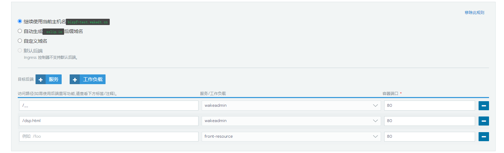

# 渐进式系统升级方案

<br>

一个复杂的'系统'可能存在较多的应用，以惟客为例，我们有 wkb、da、dmp、dsp、cdp、scrm 等若干个应用，并且这些子应用可能还有多个业态版本，涉及多个团队。

很难一次性对所有的应用进行改造。因此会维持较久的老旧并存的场面。

<br>
<br>

假设：

> - 旧的前端资源在 `frontend-resources`(主容器是 `nginx`) Pod 下, 其中挂载了以下域名的相关资源
>
>   - www.wakedt.cn + cdn.wakedt.cn -> 主系统
>   - manage.wakedt.cn + manage-cdn.wakedt.cn
>   - ma.wakedt.cn + ma-cdn.wakedt.cn
>
> - 新的微前端基座在 [`wakeadmin`](./container.md#创建微前端基座镜像)(主容器是 `wkfe/bay` ) Pod 下

<br>
<br>
<br>
<br>

渐进式升级有两种方案:

- 1. **Sidecar 迁移**。将 `frontend-resources` 下的 sidecar 迁移到 `wakeadmin` 下
- 2. **流量迁移**。保留 `frontend-resources`, 通过 Ingress 将已经完成改造的应用的流量转移到 `wakeadmin`

<br>
<br>
<br>
<br>

## 1. Sidecar 迁移

迁移步骤:

<br>
<br>

- 1. [创建 wakeadmin、wakeadmin-apps](../deploy.md)
- 2. 将 `frontend-resources` 下的 sidecar 迁移到 `wakeadmin-apps` 下
- 3. 将迁移过来 sidecar 的入口命令修改为： 将静态资源拷贝到 `/data/source/__public__/` 下( `__public__` 的静态资源是直接暴露的，不需要加任何前缀)
- 4. 注意： 如果有特殊的 nginx 配置需求, 比如装修图片的 URL 转发。 [可以将相关的 nginx 配置通过`配置映射`放到 `wakeadmin` 下的 `/data/under-server` 或 `/data/under-http` 下'](./container.md#创建微前端基座镜像)
- 5. 测试通过后， 将 www.wakedt.cn + cdn.wakedt.cn 的 ingress 流量从 `frontend-resources` 迁移到 `wakeadmin`

<br>
<br>
<br>

::: danger 注意事项
这种方式，当一个旧的应用转换为微前端子应用之后，记得将 `/data/source/__public__` 下的资源删除。举个例子：

```
/data
  /source
    /__public__
      wkb.html     # 残留的旧静态资源
    /__apps__
      /dssWeb      # -> 子应用，路由为 /wkb.html
        index.html
```

因为 `__public__` 的优先级高于其他目录，因此当加载 `http://example.com/wkb.html` 时，会优先加载 `__public__` 下面的。

:::

<br>
<br>
<br>
<br>

## 2. 流量迁移(推荐)

迁移步骤:

- 1. [创建 wakeadmin、wakeadmin-apps](../deploy.md)
- 2. 将 `wakeadmin PVC` 下的 `public` 子路径挂载到 `wakeadmin` 的 `/data/public` 容器路径下
- 3. 同时将 `wakeadmin PVC` 下的 `public/__public__` 子路径挂载到 `frontend-resources` 的 `/data/node/node-server/__public__` 容器路径下。 2 和 3 这两步主要是为了让 `frontend-resources`、`wakeadmin` 共享公共静态资源
- 4. 修改 `frontend-resources` 的 nginx 配置

     旧的配置:

     <<< @/snippets/legacy.nginx

     新的配置:

     <<< @/snippets/recommend.nginx

     新的配置去除了一些冗余的配置，并且优先从 `__public__` 中获取资源。

     <br>
     <br>

- 5. 分配 Ingress 流量到 `wakeadmin`, 假设我们已经将 dsp 迁移过来了, 那么 Ingress 配置如下：

  

  <br>

  - `/dsp.html` 这是已改造后的 dsp 子应用的 activeRule
  - `/__` wakeadmin 的内置目录都以 `__` 前缀，所以非常容易区分

  <br>
  <br>

- 6. 后续：
  - 当所有模块都完成了改造，就可以废弃掉 frontend-resources, 所有流量都走 wakeadmin
  - 或者按照 [上述 Sidecar 迁移方案](#1-sidecar-迁移), 逐步将 `frontend-resources` 的 `sidecar` 搬运过来，最后废弃掉 `frontend-resources`

<br>
<br>
<br>
<br>

## 其他子系统

对于 manage、ma 等其他子系统, 建议改造成[单应用容器](./container.md#创建单应用镜像)。在未改造之前 `frontend-resources` 依旧可以保留。

<br>
<br>
