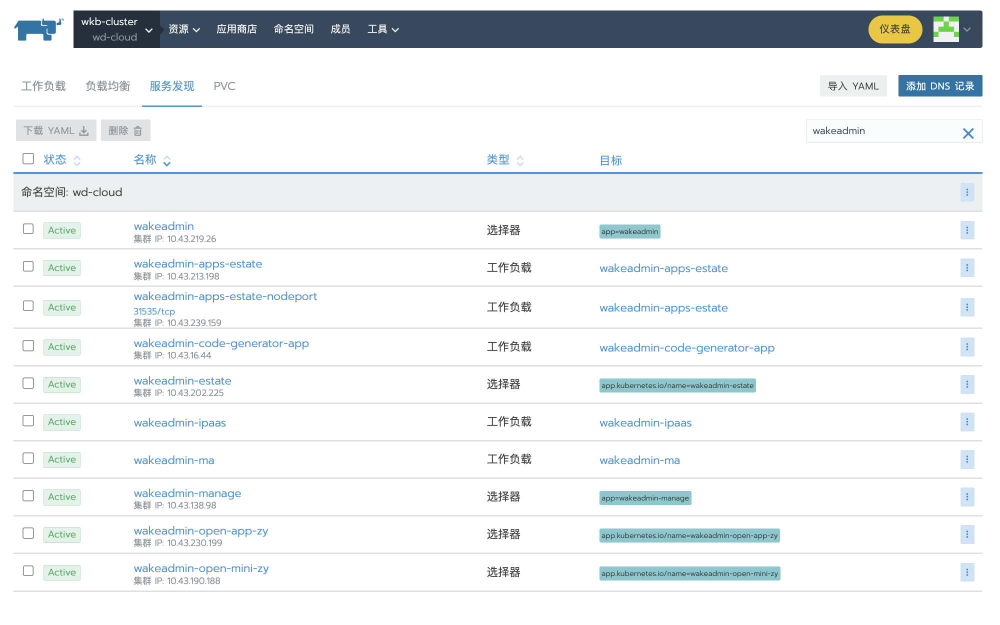
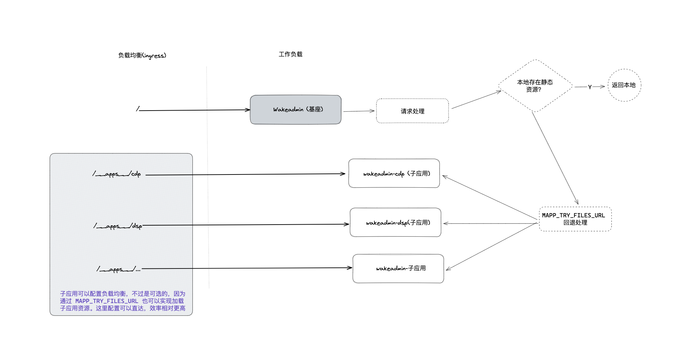

# 不支持 Sidecar 的环境如何部署微前端

部分用户环境可能不支持 Pod 挂载 Sidecar, 本文介绍如何在不支持 Sidecar 的环境下部署微前端。

有两种方式可以做到：

- 创建一个 Dockerfile, 将基座和子应用合并打包成一个镜像
- 独立子应用运行

两种方式都有各自的优缺点，我们会在下文详细描述。

<br>
<br>
<br>

## 方式 1：基座和子应用合并打包成独立镜像

我们可以独立创建一个仓库，新建一个 Dockerfile, 将所有的子应用镜像打包在一起:

`Dockerfile` 示例:

```docker
# CDP
FROM 172.26.59.200/wkfe/app-cdp:R5.0.0-S07-snapshot-129 AS cdp
RUN mkdir -p /mnt/__public__ && sh /data/entry.sh

# web
FROM 172.26.59.200/wkfe/app-web:R5.1.0-S20-snapshot-359 AS web
RUN mkdir -p /mnt/__public__ && sh /data/entry.sh

# ... 其他子应用

# ------------

# *** 基座 ***
FROM 172.26.59.200/wkfe/bay AS bay

# 基座的配置放在这里
ENV MAPP_DOMAIN wdcloud-base-test.wakedt.cn
ENV MAPP_CDN_DOMAIN wdcloud-base-test-cdn.wakedt.cn
# 在这里按需添加其他配置

# 拷贝子应用静态资源到基座目录
COPY --from=cdp /mnt/__public__ /data/source/__public__
COPY --from=cdp /mnt/__apps__ /data/source/__apps__

COPY --from=web /mnt/__public__ /data/source/__public__
COPY --from=web /mnt/__apps__ /data/source/__apps__
```

如果要添加其他的文件，比如配置文件，同理使用 COPY 命令, 举个例子, 我们要添加额外的 nginx 配置。

首先创建一些你需要挂载的 nginx 配置, 目录结构如下:

```shell
Dockerfile

# 其他需要挂载的配置文件
dsp.conf
# location ^~ /s/ {
# 	rewrite ^/(.*) /scheme.html last;
# }

dssWeb.conf
#location ~* /from-material/test/ {
#        if ($request_uri ~ /from-material/test/(.*)) {
#           set $bucketid $1;
#        }
#        proxy_store off;
#        proxy_redirect off;
#        proxy_set_header X-Forwarded-For $proxy_add_x_forwarded_for;
#        proxy_set_header X-Real-IP $remote_addr;
#        proxy_set_header X-Forwarded-Proto $scheme;
#        proxy_connect_timeout 600;
#        proxy_read_timeout 600;
#        proxy_send_timeout 600;
#        proxy_set_header X-Forwarded-Proto $scheme;
#        proxy_set_header Host "test-material-1259575047.cos.ap-guangzhou.myqcloud.com";
#        proxy_buffering off;
#        #add_header Access-Control-Allow-Origin $http_referer;
#        #add_header Access-Control-Allow-Origin $host;
#        proxy_pass "https://test-material-1259575047.cos.ap-guangzhou.myqcloud.com/$bucketid";
#    }
#    location ~* /from-material/online/ {
#        if ($request_uri ~ /from-material/online/(.*)) {
#           set $bucketid $1;
#        }
#        proxy_store off;
#        proxy_redirect off;
#        proxy_set_header X-Forwarded-For $proxy_add_x_forwarded_for;
#        proxy_set_header X-Real-IP $remote_addr;
#        proxy_set_header X-Forwarded-Proto $scheme;
#        proxy_connect_timeout 600;
#        proxy_read_timeout 600;
#        proxy_send_timeout 600;
#        proxy_set_header X-Forwarded-Proto $scheme;
#        proxy_set_header Host "online-material-1259575047.cos.ap-guangzhou.myqcloud.com";
#        proxy_buffering off;
#        #add_header Access-Control-Allow-Origin $http_referer;
#        #add_header Access-Control-Allow-Origin $host;
#        resolver 114.114.114.114;
#        proxy_pass https://online-material-1259575047.cos.ap-guangzhou.myqcloud.com/$1;
#    }

#location /from-material/ {
#        proxy_store off;
#        proxy_redirect off;
#        proxy_set_header X-Forwarded-For $proxy_add_x_forwarded_for;
#        proxy_set_header X-Real-IP $remote_addr;
#        proxy_set_header X-Forwarded-Proto $scheme;
#        proxy_connect_timeout 600;
#        proxy_read_timeout 600;
#        proxy_send_timeout 600;
#        proxy_set_header X-Forwarded-Proto $scheme;
#        proxy_set_header Host "test-material-1259575047.cos.ap-guangzhou.myqcloud.com";
#        proxy_buffering off;
#        proxy_pass https://test-material-1259575047.cos.ap-guangzhou.myqcloud.com/;
#    }

```

修改 Dockerfile, 添加 COPY 命令:

```diff
# CDP
FROM 172.26.59.200/wkfe/app-cdp:R5.0.0-S07-snapshot-129 AS cdp
RUN mkdir -p /mnt/__public__ && sh /data/entry.sh

# web
FROM 172.26.59.200/wkfe/app-web:R5.1.0-S20-snapshot-359 AS web
RUN mkdir -p /mnt/__public__ && sh /data/entry.sh

# ... 其他子应用

# ------------

# *** 基座 ***
FROM 172.26.59.200/wkfe/bay AS bay

# 基座的配置放在这里
ENV MAPP_DOMAIN wdcloud-base-test.wakedt.cn
ENV MAPP_CDN_DOMAIN wdcloud-base-test-cdn.wakedt.cn
# 在这里按需添加其他配置

# 拷贝子应用静态资源到基座目录
COPY --from=cdp /mnt/__public__ /data/source/__public__
COPY --from=cdp /mnt/__apps__ /data/source/__apps__

COPY --from=web /mnt/__public__ /data/source/__public__
COPY --from=web /mnt/__apps__ /data/source/__apps__

+ 自定义配置文件
+ COPY dsp.conf dssWeb.conf /data/under-server
```

::: tip 好处

- 使用这种方式我们不需要创建额外的 PVC 和数据卷。配置和部署都比较简单
- 不用修改原有项目的构建方式和发布方式
- 独立 git 仓库,可以跟踪子应用的版本变动

:::

::: warning 缺点

- 每个子应用更新需要修改上述的 Dockerfile, 并重新构建。相对比较繁琐

:::

<br>
<br>
<br>

## 方式 2：独立运行子应用

<br>

我们之所以需要将子应用和基座共享 PVC，是因为通过这种方式，可以让基座自动地发现子应用，以及对子应用的静态资源进行一些转换处理。如果我们不需要这些功能，那么我们可以将子应用独立运行，这样就不需要共享 PVC 了。

<br>
<br>

### 第一步：支持子应用独立运行

改造已有的 Dockerfile

比如:

```diff
-FROM wkfe/mapp-child
-
-ENV MAPP_CACHE_KEY=<%= UUID %>
-
+FROM wkfe/mapp-child AS static

# 拷贝 dist 目录下的文件到 /data
COPY dist /data
+RUN mkdir -p /mnt/__public__ && sh /data/entry.sh
+
+# 运行容器
+# 详见 https://wakeadmin.wakedata.com/mapp/advanced/container.html#%E5%88%9B%E5%BB%BA%E5%8D%95%E5%BA%94%E7%94%A8%E9%95%9C%E5%83%8F
+FROM wkfe/single AS runner
+
+COPY --from=static /mnt/__public__ /data/source/__entry__
+COPY --from=static /mnt/__apps__ /data/source/__entry__/__apps__
+
+EXPOSE 80
+
```

<br>

上面的 Dockerfile 在旧的基础上，将静态资源拷贝到 [`wkfe/single`](./container.md#创建单应用镜像) 容器中，从而支持子应用独立运行(独立的 nginx)。

<br>
<br>

::: details 另外一种方式是将已有的镜像转换成可以单独部署的形式

可以创建一个新的 Dockerfile(比如命名为 Dockerfile.standalone), 支持子应用独立运行:

```docker
# 静态资源
FROM 172.26.59.200/wkfe/app-cdp:R5.0.0-S07-snapshot-129 AS static
RUN mkdir -p /mnt/__public__ && sh /data/entry.sh

# 运行容器
# 详见 https://wakeadmin.wakedata.com/mapp/advanced/container.html#%E5%88%9B%E5%BB%BA%E5%8D%95%E5%BA%94%E7%94%A8%E9%95%9C%E5%83%8F
FROM wkfe/single AS runner

COPY --from=static /mnt/__public__ /data/source/__entry__
COPY --from=static /mnt/__apps__ /data/source/__entry__/__apps__

EXPOSE 80
```

:::

<br>
<br>
<br>

Ok, 构建完成后，这个镜像就是一个支持被独立访问的应用了。这个镜像支持类似基座的配置，比如配置域名、CDN 域名等等，按需配置即可：

```
MAPP_DOMAIN wdcloud-base-test.wakedt.cn
MAPP_CDN_DOMAIN wdcloud-base-test-cdn.wakedt.cn
```

<br>
<br>
<br>
<br>

### 第二步： 配置基座

基座还是按照旧的方式进行部署。不过因为现在子应用的独立运行的，基座无法发现对应的子应用，需要我们手动配置。

在基座的配置文件中加入子应用配置:

```yaml
microApps:
  - name: 'cdp'
    version: '5.0.0'
    entry: __apps__/cdp/
    activeRule: /cdp.html
  # 其他子应用同理
  - name: 'other'
    version: '5.0.0'
    entry: __apps__/other/
    activeRule: /other.html
```

关于子应用的配置，可以参考 [子应用配置](../integration.md#2-子应用描述信息)

或者从子应用构建完成的 dist 目录中找到 `mapp.json` 文件，将相关信息拷贝过来即可.

<br>
<br>
<br>
<br>

### 第三步: 配置负载均衡

之前所有的流量都是走基座的，现在子应用独立出来了，需要将流量重新分配到子应用上。 以 cdp 为例，需要将 `__apps__/cdp` 分流到 cdp 子应用上。

另外，**如果子应用还有一些公开的静态资源，比如 dss-web 下面的 login.html、app.html、resources 等等也需要显式手动分配，这个可能会非常繁琐**。为了解决这个问题，我们可以在`基座`上添加 `MAPP_TRY_FILES_URL`(需要 wkfe/bay:1.1.0 以上版本) 环境变量配置，举个例子:

```shell
MAPP_TRY_FILES_URL http://wakeadmin-cdp,http://wakeadmin-web,http://wakeadmin-cdp
```

它的运作原理类似于 nginx 的 [try_files](https://nginx.org/en/docs/http/ngx_http_core_module.html#try_files) 指令，即基座在找不到对应的静态资源时，会依次尝试这些 URL，直到找到为止。

现在我们只需要将各个子应用的内部地址(K8S Service)配置到这个环境变量中即可。

<br>
<br>

::: tip 子应用内部地址？
通常在 K8S(比如 Rancher) 上创建工作负载后，会自动为这个工作负载创建一个服务，集群内的工作负载之间可以通过这些服务名称+对应的端口号进行通信:


:::

<br>
<br>

Ok, 这个就是整体的拓扑图：



<br>
<br>
<br>
<br>
<br>

::: tip 好处

- 子应用可以独立部署

:::

<br>

::: warning 缺点

- **需要在基座上手动配置子应用的信息(子应用信息+MAPP_TRY_FILES_URL 环境变量)**
- **每个子应用都要配置 `MAPP_DOMAIN` `MAPP_CDN_DOMAIN` 等配置**
- <del>负载均衡路由配置比较繁琐</del>(可以通过 MAPP_TRY_FILES_URL 解决)

:::
