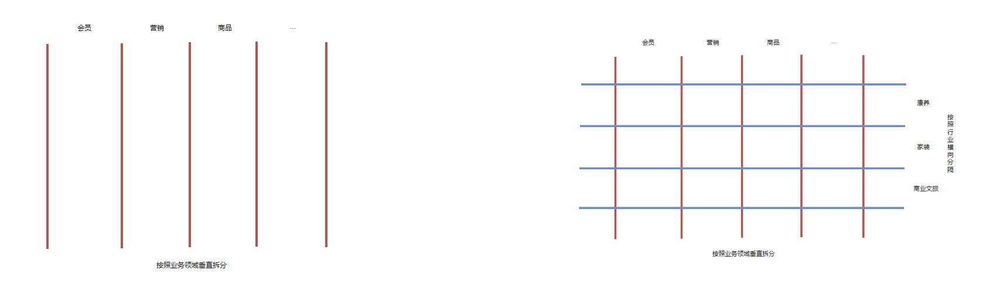

# 多业态子应用

<br>

[[toc]]

<br>
<br>

我们在 [多行业融合开发方案](https://www.notion.so/wakedata/358c4bafc42b42acacab2c74f3f21593) 中详细介绍了多行业融合开发、隔离、扩展的一些设计模式。

<br>



<br>

**实际上，微前端解决是是垂直拆分问题，并不能给行业多态问题提供质的解决办法。**, 因此，`隔离`依旧是实现行业多态的一种主要方式。

<br>
<br>

## 创建业态应用

业态应用是与标品应用相互独立的子应用，比如 wkb 是标品运营中心， 那么康养业态下可以创建一个 `kangyangWkb`。

`wkb` 子应用描述:

```js
{
  name: 'wkb',
  activeRule: '/wkb',
  alias: 'wkb',
  entry: '__apps__/wkb'
}
```

<br>

`kangyangWkb` 子应用描述:

```js
{
  name: 'kangyangWkb',
  activeRule: '/ky/wkb',
  alias: 'wkb',
  entry: '__apps__/kangyangWkb'
}
```

- name。必然是要保持唯一的
- activeRule。路由也保持独立，业态应用可以使用业态名作为前缀
- alias。alias 可以用于绑定到同一个身份上。下文会介绍它能起到什么效果。

<br>
<br>
<br>
<br>

## 业态应用跳转

配置完应用之后，基座按照后台返回的权限菜单会自动识别要挂载哪个应用就行了。

<br>

但是在跨应用路由跳转时会存在问题, 举个例子，我们需要从某个页面跳转到 wkb, 我们应该跳转到
`/wkb` 还是 `/ky/wkb` 呢? 按理说，如果在 kangyang 业态下，就跳转到 `/ky/wkb`, 否则就跳转到 `/wkb`。

所以，你可能看过这样的代码:

```js
if (industry === 'kangyang') {
  goto('/ky/wkb')
} else if (industry === 'home') {
  goto('/home/wkb')
  // ...
} else {
  goto('/wkb)
}
```

<br>
<br>

在子应用内部好办，我们规范使用[命名路由](https://router.vuejs.org/zh/guide/essentials/named-routes.html)，可以避免耦合页面路径。

一样的道理，基座也支持类似命名路由的形式进行跨应用或者应用内部的跳转:

<br>

### 第一种方式：通过 alias 跳转

上面的例子中，我们将两个应用都绑定到了同一个 alias 上，现在就可以使用基座提供的 [openByAppAlias](../api.md#34-路由) 来进行导航：

<br>

```js
import bay from '@wakeadmin/bay';

bay.openByAppAlias('wkb', { hashPath: '/goods', hashQuery: { foo: 'bar' } });
```

<br>

基座会根据权限菜单来决策，最终导航的子应用。假设菜单列表中存在 '/ky/wkb', 那么导航的就是 kangyangWkb, 最终基座会拼装路径为 `/ky/wkb#/goods?foo=bar` 进行导航。

<br>
<br>
<br>

### 第二种方式： 通过权限标识符

权限标识符就是`权限管理平台`维护的'命名路由', 非常适合用来导航。 通过 `openByIdentifierPath` 方法来进行调用：

```js
import bay from '@wakeadmin/bay';

bay.openByIdentifierPath('goods.delete', { hashQuery: { foo: 'bar' } });
```

<br>
<br>
<br>
<br>

## 跳板页

为了方便外部访问、分享， 基座也提供了类似 [C 端的跳板页机制](https://www.notion.so/wakedata/1f26cd45e84c4b18954abf91a16274e7)。

```js
import bay from '@wakeadmin/bay';

share(await bay.generateLandingUrl({type: 'app-alias', {hashPath: '/goods'}}, true))
```

<br>
<br>
<br>
<br>
