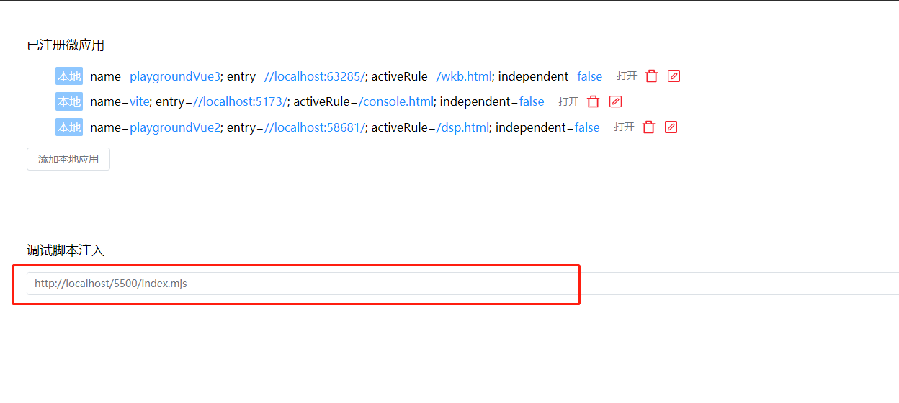

# 主题包定制

开发者可以根据客户需求自行定制主题包。

<br>

对于[运行容器](./container.md)而言，`主题包`就是一个普通的 `npm` 包，通过 `npmTheme` 属性指定：

```yaml
npmTheme: 'my-theme' # 可以指定版本号，比如 my-theme@0.1.0

# 如果你的 npm 包发布在私有环境，需要指定 registry
# 不过我们还是建议你将 主题包 发布到 npm 官方仓库, 因为私有环境通常在内网才能访问
# npmRegistry: 'http://npm.wakedata-inc.com'
```

<br>

::: info
建议将主题包发布到 npm 官方仓库
:::

<br>

当配置了 npmTheme, [运行容器](./container.md)就会自动拉取下来，并将 `dist` 目录下的所有文件，拷贝到 `__theme__` 目录下。

<br>
<br>

## 创建主题包

通过我们提供的脚手架来创建主题包:

<br>

```shell
$ pnpm create wakeadmin wk-my-theme # 选择 theme
```

<br>
<br>
<br>

## 主题包目录结构

以下是默认创建的主题包目录结构：

<br>

```shell
.
├── adapter                  # CSS 主题变量适配器
│   ├── element-plus-ep.css
│   ├── element-plus.css
│   ├── element-ui.scss
│   └── theme.scss
├── theme.css                 # CSS 主题变量声明
├── src                       # scss 样式包
│   ├── element-plus.scss
│   ├── element-ui.scss
│   └── share.scss
├── static                    # 静态资源
│   ├── config.yml
│   ├── logo.png
│   ├── fonts
│   │   ├── element-icons.ttf
│   │   └── element-icons.woff
│   └── i18n
│       ├── README.md
│       └── zh.tr
├── build                     # 构建脚本
├── dist                      # 构建输出目录
├── index.d.ts
├── index.js
├── index.mjs
├── package.json
```

<br>
<br>

- **`theme.css`**。在这里定义 [CSS 主题变量](../../theme/color.md)

  <br>

- **`adapter`**。这里定义了一些适配器，将 `theme.css` 定义的主题变量映射到 element-ui、element-plus 中。 **`大部分场景你不需要改动它, 保留这里的映射规则就行`**。
  下面是 element-plus.css 的部分代码片段：

  ```css
  --el-color-primary: var(--wk-color-primary);
  --el-color-primary-light-3: var(--wk-color-primary-800);
  --el-color-primary-light-5: var(--wk-color-primary-600);
  --el-color-primary-light-7: var(--wk-color-primary-400);
  --el-color-primary-light-8: var(--wk-color-primary-200);
  --el-color-primary-light-9: var(--wk-color-primary-50);
  --el-color-primary-dark-2: var(--wk-color-primary-900);
  ```

  <br>

- **`src`**。src 下的 \*.scss 目录都会编译为单独的 \*.css 文件, 你可以在这些文件中进行一些配置、组件样式覆盖之类的工作

  - element-plus.scss。 element-plus 样式包
  - element-ui.scss。 element-ui 样式包
  - share.scss。 通用样式

  <br>

- **`static`**。 static 下的所有文件将被原封不动拷贝到 dist 目录，我们可以在这里放置:

  - 语言包。以 `<language>.tr` 形式命名。可以被 [运行容器](./container.md) 自动识别。 举例

    ```shell
    static/
      i18n/
        zh.tr
        en.tr
        zh-Hant.tr
    ```

  - 配置。以 `*.yml` 或 `*.yaml` 形式命名。可以被 [运行容器](./container.md) 自动识别。举例：

    ```yaml
    # 变量配置

    title: '惟客数据\_让客户经营更简单'
    description: '惟客数据,专注客户经营,以大数据和 AI 人工智能为核心的数字化客户经营服务商,面向地产,家居,汽车,泛零售,康养等线下行业提供客户经营,数据中台,CDP,SCRM,大数据分析等数字化客户经营系统,帮助传统企业提升客户服务体验和经营效率'
    keywords: '客户经营,数据中台,业务中台,CDP,客户数据平台,大会员,大运营,数字化转型,大数据分析,地产数字化,零售数字化,泛家居数字化,康养数字化,汽车数字化,SCRM,门店经营管理,传统企业转型'

    # 基座静态资源覆盖
    assets:
      # asset 可以使用 <BASE_URL> 占位符，表示基座的基础路径, 静态资源的引用建议以这个开始
      IMG_BAY_LOGO: '<BASE_URL>/__theme__/logo.png'
      TXT_BAY_FOOTER: '版权归惟客所有'
    ```

  - 其他静态资源。比如字体、图片。

  <br>

<br>
<br>
<br>
<br>

## 构建和发布

<br>

一切修改完毕后，记得修改 `package.json` 的 `name`、`version` 等信息。

执行下列命令构建:

```shell
$ pnpm build
```

<br>

::: info
怎么调试？

- 方式 1(推荐)： 执行 `pnpm serve` 启动本地复用，比将 'http://localhost/5500/index.mjs' 放到`基座调试脚本` 中
  <br>

  

  <br>
  <br>

- 方式 2： 本地启动基座项目。并通过 npm link 链接到基座进行导入。
- 方式 3(不推荐)： 在 Rancher 上关闭 npmTheme，手动将 `dist` 目录内容拷贝到 `__theme__` 目录。 详见 [子应用部署](../deploy.md#子应用部署)

:::

<br>
<br>

最后发布：

```shell
# 发布到 npm 官方，在此之前需要 npm adduser 进行登录
$ pnpm publish --registry=https://registry.npmjs.org
```

<br>
<br>

## 切换主题

只需要将运行容器的 `npmTheme` 配置为你发布 npm 包即可。
