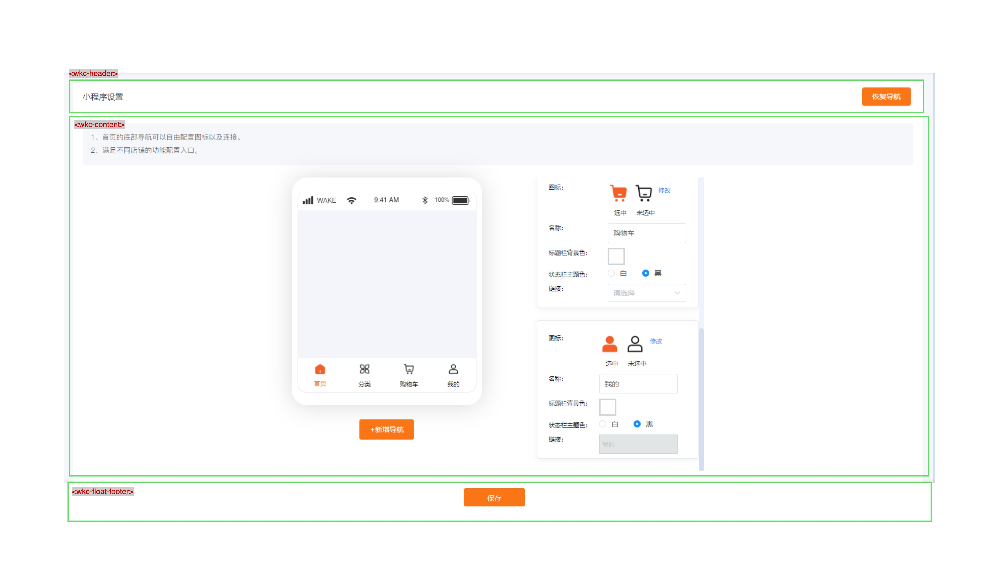
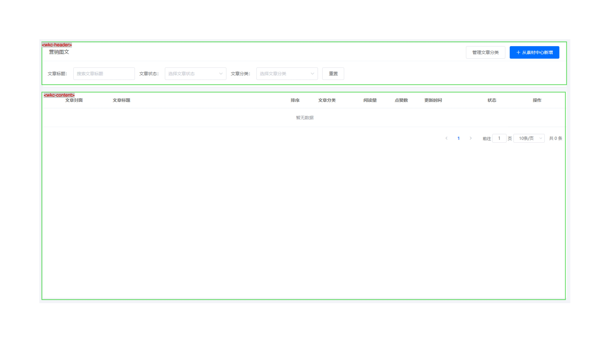

# 基座 API 索引

<br>
<br>

## 目录

[[toc]]

<br>
<br>

## 1. 安装和使用

<br>

```shell
$ pnpm add @wakeadmin/bay
```

<br>

初始化和子应用挂载(Vue2 为例，详见 [子应用集成](./integration.md)):

<br>
<br>

```js{10,14-55}
import Vue from 'vue';
import Bay from '@wakeadmin/bay';

import App from './App.vue';
import router from './router';
import store from './store';

Vue.config.productionTip = false;

Vue.use(Bay); // 注册插件

let instance: Vue;

Bay.createMicroApp({
  /**
   * 启动时被调用。全局只会调用一次。
   */
  async bootstrap(props) {
    console.log('bootstrap', props);
  },

  /**
   * 挂载, 会调用多次。
   */
  async mount(container, props) {
    console.log('mount', props);

    instance = new Vue({
      router,
      store,
      render: h => h(App),
    });

    instance.$mount(container?.querySelector('#app') || '#app');
  },

  /**
   *  卸载
   */
  async unmount(props: any) {
    console.log('unmount', props);

    if (instance) {
      instance.$destroy();
    }
  },

  /**
   * props 更新，可选
   */
  async update(props: any) {
    console.log('update', props);
  },
});

```

<br>
<br>

## 2. 组件

### wkc-allows

权限判断，如果检查通过就渲染 children:

```html
<wkc-allows to="delete"><button>删除</button></wkc-allows>
```

to 指定权限标识符, **基座会基于[上下文进行检查](./menu.md#三种权限标识符匹配方式)，不需要指定全限定权限标识符**。

<br>

属性:

| 名称                  | 描述                                                                                                                       | 默认值 |
| --------------------- | -------------------------------------------------------------------------------------------------------------------------- | ------ |
| `to: string`          | 权限标识符, 多个权限标识符可以使用 `,` 分割                                                                                | 必填   |
| `type: 'AND' \| 'OR'` | 当 `to` 指定多个权限标识符时。可以通过 type 指定组合判断的方式。AND 表示所有权限标识符都必须满足。而 OR 只需要满足一个即可 | 'OR'   |

<br>

事件:

| 名称                | 描述                     |
| ------------------- | ------------------------ |
| `allow: () => void` | 在授权通过后该事件会触发 |

<br>
<br>
<br>

### wkc-allows-page

和 `wkc-allows` 差不多，只不过用于专门包裹页面内容。如果没有审核没通过会显示 `403` 错误提示。

<br>
<br>
<br>

### wkc-breadcrumb

面包屑。基座根据激活的菜单树自动生成。

<br>

属性:

| 名称                                                             | 描述           | 默认值 |
| ---------------------------------------------------------------- | -------------- | ------ |
| includeRoot                                                      | 是否展示根节点 | false  |
| `list?: Array<{id?: string, title: string, onClick?: Function}>` | 扩展自定义节点 | `[]`   |

<br>
<br>
<br>

### wkc-content

用于放置页面主体内容，通常和 `wkc-header` 配合。

<br>
<br>
<br>

### wkc-float-footer

底部浮动操作栏。通常用于放置表单提交按钮



<br>
<br>
<br>

### wkc-fullscreen

使用 fixed 布局的方式, 全屏展示内容。

<br>
<br>
<br>

### wkc-menuless

隐藏菜单栏、侧边栏

<br>
<br>
<br>

### wkc-header

页面头部展示。基本上所有页面都会使用到它。 如果当前页面是四级菜单，会自动渲染四级菜单 Tab。

<br>



<br>

属性：

| 名称           | 描述                                      | 默认值                                                       |
| -------------- | ----------------------------------------- | ------------------------------------------------------------ |
| title?: string | 标题。复杂渲染内容，也可以使用 title slot | 默认从菜单中取，如果没在权限菜单中定义的页面，需要配置 title |

<br>

插槽

| 名称    | 描述                     |
| ------- | ------------------------ |
| title   | 标题                     |
| extra   | 标题右侧的扩展区域       |
| default | 主体内容，通常是表单筛选 |

<br>
<br>
<br>

### wkc-header-slot

顶部导航栏扩展插槽

<br>
<br>

### wkc-header-dropdown-menu

顶部导航栏 > 用户下拉列表菜单扩展插槽

<br>

属性

| 名称          | 描述                                                         | 默认值 |
| ------------- | ------------------------------------------------------------ | ------ |
| title: string | 菜单标题                                                     | 必填   |
| icon?: string | 菜单图标。 支持[内置图标](../icons/index.md) 或者 `svg` 图标 | 空     |

<br>

事件

| 名称  | 描述           |
| ----- | -------------- |
| click | 菜单点击时触发 |

<br>
<br>

### wkc-sidebar-top-slot / wkc-sidebar-bottom-slot

侧边栏扩展插槽。侧边栏插槽应该适配菜单的展开状态和折叠状态

插槽：

| 名称     | 描述                                 |
| -------- | ------------------------------------ |
| default  | 默认插槽，不管是折叠还是展开都会渲染 |
| collapse | 折叠状态展示内容                     |
| expand   | 展开状态展示内容                     |

<br>
<br>
<br>
<br>

### wkc-icon

图标展示。

<br>

```html
<wkc-icon icon="add" />
```

<br>

icon 可以是以下类型：

- [内置图标名](../icons/index.md)。
- `<svg>...</svg>` 字符串
- `http://...` 链接。将使用 `` 来渲染
- 在 [assets](./theme.md#如何定制文案、图片等静态资源？) 中定义的 asset 名称

<br>
<br>
<br>
<br>

### wkc-error-page

错误页面。

<br>

属性:

| 名称                 | 描述                                  |
| -------------------- | ------------------------------------- |
| description?: string | 错误描述, 也可以使用 description 插槽 |
| image?: string       | 错误展示图片。也可以使用 image 插槽   |

<br>

插槽

| 名称        | 描述                       |
| ----------- | -------------------------- |
| image       | 自定义图片展示区域         |
| description | 自定义错误描述展示区域     |
| default     | 自定义详细错误信息展示区域 |

<br>
<br>

### wkc-error-page-not-found

默认 404 展示页面

<br>
<br>

### wkc-error-forbidden

默认 403 展示页面

<br>
<br>
<br>
<br>

## 3. API

### 3.1 eventBus

基座暴露了 [eventBus](https://nodejs.org/dist/latest-v16.x/docs/api/events.html) 对象，可以用于子应用之间的通信。

```js
import bay from '@wakeadmin/bay';

bay.eventBus.on('some-event', () => {
  // 事件处理
});
```

<br>
<br>

### 3.2 权限检查

<br>

```ts
// 异步方法：会等待 基座就绪
async function allows(to: string[] | string, type: 'AND' | 'OR' = 'OR'): Promise<boolean>;

// 同步方法
function allowsSync(to: string[], type: 'AND' | 'OR' = 'OR'): boolean;
```

判断是否有指定权限：

```js
import bay from '@wakeadmin/bay';

const hasPermission = await bay.allows(['some-permission']);
```

<br>

我们更推荐使用 `wkc-allows` 组件。

<br>
<br>
<br>

### 3.3 侧边栏、菜单栏操作

- `toggleSidebar(): void` 切换侧边栏展示
- `getSidebarCollapsed(): Promise<boolean>` 获取侧边栏的展示状态
- `expandSidebar(): void` 展开侧边栏
- `collapseSidebar(): void` 折叠侧边栏

<br>

- `showSidebar(): void` 显示侧边栏
- `hideSidebar(): void` 隐藏侧边栏

<br>

- (0.8.0")`showMainLoading(): void` 显示内容区加载动画
- (0.8.0")`hideMainLoading(): void` 隐藏内容区加载动画

<br>

- `showMenu(): void` 显示导航栏和侧边栏
- `hideMenu(): void` 隐藏导航栏和侧边栏

<br>
<br>

### 3.4 路由

<br>
<br>

- `openByAppName(name: string, options?: AppNavigateOptions): void`

  通过应用名称打开子应用。options 类型信息见下文

  <br>
  <br>
  <br>

- `openByAppAlias(alias: string, options?: AppNavigateOptions): void`

  通过应用别名打开子应用。`options` 类型信息见下文。一个 `alias` 可能绑定到了多个子应用，基座会根据权限管理后台配置的菜单，决定最终在要跳转到的子应用。

  举个例子, 有两个应用 `wkb` 和 `kyWkb`， 都绑定到了 `wkb` 这个 `alias`：

  ```js
  // wkb
  {
    name: 'wkb',
    alias: 'wkb',
    activeRule: '/wkb'
  }

  // kyWkb
  {
    name: 'kyWkb',
    alias: 'wkb',
    activeRule: '/ky/wkb'
  }

  ```

  假设`权限管理平台`菜单包含了 `/ky/wkb` 这个页面路由，那么基座就会选择 `kyWkb` 这个子应用进行跳转。

  如果 alias 没有匹配到任何应用，将回退到 `openByAppName`

  <br>
  <br>
  <br>

- `openMain(options?: NodeNavigateOptions): void`

  打开主界面, 即菜单定义的第一个根节点

  <br>
  <br>
  <br>

- `openByIdentifierPath(path: string, options?: NodeNavigateOptions): void`

  通过**权限标识符**打开页面。权限标识符支持[`全限定路径匹配`和`模糊匹配`](./menu.md#_3-权限管理)

  <br>
  <br>
  <br>

- `openTreeNode(node: TreeNode, options?: NodeNavigateOptions): void`

  底层方法。通过菜单节点打开页面

  <br>
  <br>
  <br>

- `openError(data: ErrorPageProps & RouteLocationOptions): void`

  打开错误页面

  <br>

- `openUrl(url: string | (RouteLocationAsPathAndHash & RouteLocationOptions)): void`

  底层方法，打开链接。底层使用 `history.replaceState` 或 `history.pushState` 方法跳转

  <br>

- `openOutside(url: string, options?: RouteLocationOptions): void`

  底层方法，打开外部链接。底层使用 `window.location.replace` 或 `window.location.assign` 方法跳转

  <br>

- `generateLandingUrl(props: LandingProps, addHost?: boolean): Promise<string>`

  生成跳板页链接。 `addHost` 表示返回值是否携带域名信息.

  基座和*惟客云的 C 端*一样，支持跳板页。通过跳板页可以通过`应用名称`、`权限标识符`等方式来进行路由跳转，从而避免耦合具体的路由。

  ```ts
  /**
   * 落地页参数
   */
  export type LandingProps =
    | { type: 'app'; name: string; options?: AppNavigateOptions } // 微应用
    | { type: 'app-alias'; alias: string; options?: AppNavigateOptions } // 微应用别名
    | { type: 'main'; options?: NodeNavigateOptions } // 主页面
    | { type: 'identifier'; path: string; options?: NodeNavigateOptions } // 权限标识符路径
    | { type: 'url'; url: string | RouteLocationAsPathAndHash }; // 自定义 url;
  ```

  <br>
  <br>

<br>

类型信息:

<br>

```ts
export interface RouteLocationOptions {
  /**
   * 重定向模式
   */
  redirect?: boolean;
}

export interface AppNavigateOptions extends RouteLocationOptions {
  /**
   * hash 路由
   */
  hashPath?: string;

  /**
   * pathname 部分查询字符串
   */
  query?: LocationQueryRaw;

  /**
   * hash 部分查询字符串
   */
  hashQuery?: LocationQueryRaw;
}

export interface NodeNavigateOptions extends RouteLocationOptions {
  /**
   * 查询字符串
   */
  query?: LocationQueryRaw;

  /**
   * 子路由查询字符串
   */
  hashQuery?: LocationQueryRaw;
}

export type ErrorPageProps =
  | {
      // HTTP 错误
      type: 'http';
      /**
       * HTTP 错误代码
       */
      code?: string;
    }
  | {
      // 自定义错误
      type: 'custom';
      title?: string;
      detail?: string;
    };
```

<br>
<br>
<br>
<br>

### 3.5 会话操作

- `logout(): void` 退出登录

<br>
<br>
<br>

### 3.6 多语言

- `getLocale(): string` 获取当前语言
- `setLocale(locale: string): void` 设置当前语言
- `registerBundles(bundles: { [locale: string]: I18nBundle }): Promise<void>` 注册语言包

<br>

#### 3.6.1 语言包

子应用、主题包都可以覆盖基座的语言包, 基座当前的语言包配置见[这里](http://gitlab.wakedata-inc.com/wakeadmin/tools/-/tree/master/packages/bay/src/i18n)

<br>

#### 3.6.2 菜单多语言

菜单的多语言由子应用提供，基座使用以下表达式来获取菜单的文案:

<br>

```js
t(`menu.${node.identifierPath}$`, node.name);
```

<br>

- `identifierPath` 为菜单节点的[全路径权限标识符](./menu.md#1-全限定匹配)
- `name` 为菜单原本配置的名称。 当语言包未配置时，回退显示 `name`。
- 以 `$` 结尾。也就是说，你配置的语言包的 ‘叶子节点' 都要以 $ 结束， 如下文所示

<br>
<br>

子应用注册格式示例：

```json
{
  "menu": {
    "marketing$": "Marketing",
    "marketing": {
      "autoMarketing$": "Journeys",
      "autoMarketing": {
        "autoMarketing_group$": "Journey List",
        "autoMarketing_group": {
          "all_group$": "All Segments",
          "default_group$": "Default Group",
          "deleted_group$": "Deleted Journey",
          "regression_group$": "Regression Grouping",
          "test_group$": "Test Group"
        },
        "autoMarketing_template$": "Journey Template",
        "thirdEvent$": "Third Events",
        "webHook$": "WebHook",
        "webHook": {
          "add$": "New",
          "privateKey$": "Key Information"
        }
      }
    }
  }
}
```

<br>
<br>
<br>
<br>

### 3.7 assets

`asset` 设置和获取， 关于 `assets` 的用法见 [主题包](./theme.md#如何定制文案图片等静态资源)

- `getAsset(key: string, fallback: string): string` 获取 asset
- `registerAsset(key: string, value: string): void` 注册 asset

<br>
<br>

你可以通过 assets 来影响基座的文案、图标。通常我们推荐在主题包中配置这些信息，下面的示例是通过 assets 来注册图标:

```js
import bay from '@wakeadmin/bay';

bay.registerAsset('ICON_ADD', '<svg>...</svg>');
```

<br>
<br>
<br>
<br>

### 3.8 基座

- `waitSetup(): Promise<void>` 等待基座启动完毕
- `createMicroApp(options): void` 创建子应用

  ```ts
  export interface MicroAppOptions<Props = {}> {
    /**
     * 应用启动逻辑
     */
    bootstrap?: (props: Props) => Promise<void>;

    /**
     * 应用挂载
     */
    mount: (container: HTMLElement | undefined, props: Props) => Promise<void>;

    /**
     * 应用更新
     */
    update?: (props: Props) => Promise<void>;

    /**
     * 应用卸载
     */
    unmount: (props: Props) => Promise<void>;
  }
  ```

  <br>

- `isMicroApp: boolean` 是否为微前端模式。如果你的应用需要支持在微前端基座之外对渲染，可以用这个变量进行判断
- `getMicroApp(): MicroApp | undefined` 获取子应用描述信息
- `getBayBaseUrl(): string | undefined` 获取基座的 baseUrl
- `getActiveRule(): string | string[] | undefined` 获取当前子应用的 activeRule
- (0.8.0")`addExcludeAssetFilter(filter: string | Regexp | ((src: string) => boolean) ): void` [指定部分资源绕过 qiankun 的沙箱](https://qiankun.umijs.org/api#startopts)。直接在基座加载, 详见 [FAQ: 地图无法正常加载](./faq.md#地图无法正常加载)
- (0.8.0")`addGlobalVariable(name: string, value: any): void;` 添加变量到真实的 window 对象上，绕开沙箱，**注意：只能在必要的场景使用，后果自负**
- (0.8.0")`deleteGlobalVariable(name: string): void` 删除真实的 window 对象上的变量，绕开沙箱，**注意：只能在必要的场景使用，后果自负**
