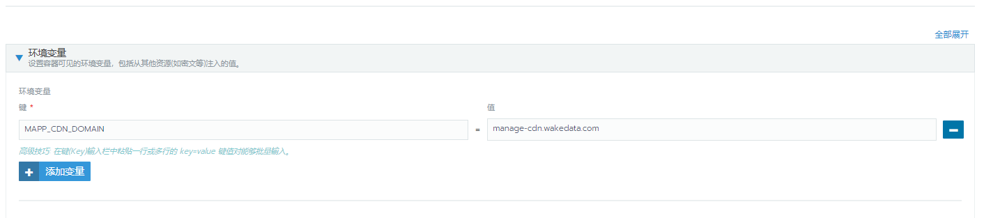
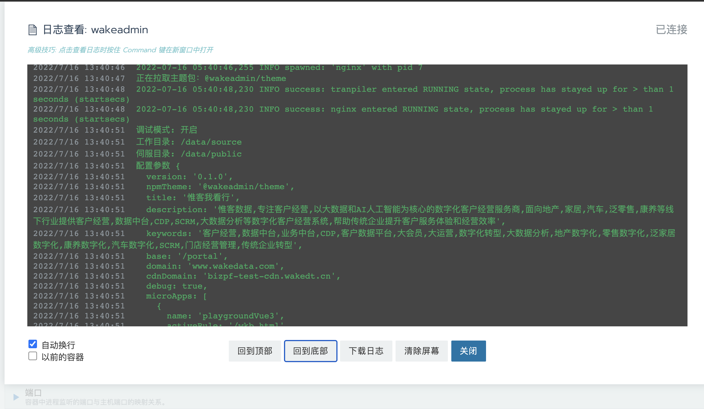
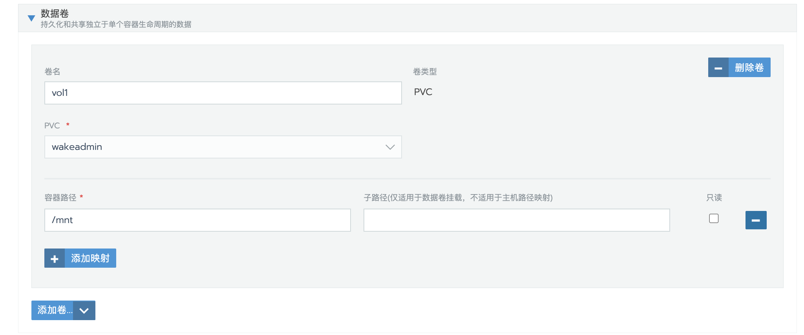

# 部署

<br>

[[toc]]

<br>
<br>

大部分公司引入微前端方案，都会带来一些复杂度的增加，比如部署和调试。

<br>

我们极力避免这种情况的发生，我们的目标是:

<br>

> **部署必须比以前更加简单**, 而且允许我们在部署阶段做更多事情，而不是每次变动都要重新开发、构建、部署。从而能够应付简单的个性化需求。

<br>
<br>
<br>
<br>

## 1. 运行容器

为了做到这个，我们开发了一个微前端的[运行容器](./advanced/container.md):

<br>


<br>

运行容器的结构如上。很简单，就包含两个部件：

- `nginx`。毫无疑问，nginx 是静态资源伺服的最佳能手。
- `transpiler`。这是一个搬运工，主要负责配置收集、代码转换。并将转换后的静态资源交给 `nginx` 伺服。 下面会详细解释

<br>
<br>

运行容器约定的目录结构如下:

```shell
/data/
  /source/
    /__public__/

    /__config__/
      config.yml
      any-sub-dir/
        my-config.yml

    /__entry__/
      js/
      index.html

    /__apps__/
      wkb/
      dsp/
      dmp/
        js/
        mapp.json
        index.html

    /__i18n__/
      zh.tr
      en.tr
      any-sub-dir/
        zh.tr
        en.tr

    /__theme__/
      config.yml
      element-ui.css
      element-plus.css
      fonts/
      i18n/
        zh.tr
        en.tr

  /public/
```

<br>
<br>

目录结构解析：

- `/data/source`。没错，`transpiler` 就是转译和搬运这里的静态资源。
- `/data/public`。 `transpiler` 就是将资源转译后搬运到这里，`nginx` 对外伺服这个目录。

<br>
<br>

再来看 `/data/source`

- `__entry__`: 基座编译之后的代码就放在这里。
- `__apps__`: 子应用编译之后的代码就放在这里，按照 `name` 区分目录。
- `__i18n__`: 扩展语言包，文件按照 `<language>.tr` 命名， 子目录的 .tr 文件也会被扫描到。
- `__config__`: 配置目录。配置文件使用 `*.yml` 或 `*.yaml` 命名，也可以放在子目录下。
- `__theme__`: 主题包目录。可以手动维护，也可以使用 `npmTheme` 配置项, 让 `transpiler` 从 npm 拉取。
- `__public__`: 公共资源目录。这些资源可以直接访问，而不需要 `__public__` 前缀。举个例子:

  ```shell
    __theme__/
      index.css  # -> 访问链接 example.com/__theme__/index.css
    __public__/
      hello.html # -> 访问链接 example.com/hello.html
  ```

<br>
<br>

那 `transpiler` 的工作过程应该比较清晰了：

- 扫描 `__apps__` 下的`子应用`。开发者也可以在*子应用目录下*使用 `mapp.json` 显式定义子应用描述信息。扫描后的子应用信息将放在 `microApps` 变量下。
- 扫描 `__config__` 下的配置文件。解析出配置信息。
- 扫描 `__i18n__` 下的 `*.tr`, 解析结果放在 `i18n` 变量下。
- 扫描 `__theme__` 目录。`__theme__` 主题包也支持携带配置文件、语言包，所以这些信息也会合并到配置信息中。另外 CSS 文件、JavaScript 文件将被收集到 `theme` 变量中。

<br>

扫描完毕之后，`transpiler` 拿着配置信息进行模板转译，将 `/data/source` 下的静态资源转换被拷贝到 `/data/public` 目录下。

<br>

来看个实际的例子：

```html
<!DOCTYPE html>
<html lang="">
  <head>
    <meta charset="utf-8" />
    <meta http-equiv="X-UA-Compatible" content="IE=edge" />
    <meta name="viewport" content="width=device-width,initial-scale=1" />
    <meta name="description" content="[%= description %]" />
    <meta name="keywords" content="[%= keywords %]" />
    <link rel="icon" href="[%= assets.IMG_BAY_FAVICON || entryPath + '/favicon.png' %]" />
    <meta name="version" content="[%= version %]" />
    <meta name="update-time" content="[%= `${year}-${month}-${date}` %]" />
    <title>[%= title %]</title>
    <!--! [%- theme.stylesheets.map(i => `<link rel="stylesheet" href="${i + '?' + hash }" />`).join('\n') %] -->
    <!--! [%- theme.scripts.map(i => `<script async="true" src="${i + '?' + hash}"></script>`).join('\n') %] -->
    <!--! [% if (microApps.length) { %] -->
    <!--! [%- 
      `<script>
        // 微应用注入
        (window.__MAPPS__ = (window.__MAPPS__ || [])).push(${microApps.map(i => JSON.stringify(i)).join(', ')});
      </script>`
    %] -->
    <!--! [% } %]-->
    <!--! [%- `<script>
      // 静态资源注入
      (window.__MAPP_ASSETS__ = (window.__MAPP_ASSETS__ || [])).push(${JSON.stringify(assets)});

      // 全局共享的语言包
      window.__I18N_BUNDLES__ = ${JSON.stringify(i18n)};
    </script>` %] -->
    <script
      defer="defer"
      src="[%= cdnDomain ? '//' + cdnDomain : '' %][%= removeTrailingSlash(base) %]/__entry__/js/chunk-vendors.582ba02c.js?[%= hash %]"
    ></script>
    <script
      defer="defer"
      src="[%= cdnDomain ? '//' + cdnDomain : '' %][%= removeTrailingSlash(base) %]/__entry__/js/app.01bd68bb.js?[%= hash %]"
    ></script>
    <link
      href="[%= cdnDomain ? '//' + cdnDomain : '' %][%= removeTrailingSlash(base) %]/__entry__/css/app.d835cada.css?[%= hash %]"
      rel="stylesheet"
    />
  </head>

  <body>
    <noscript
      ><strong
        >We're sorry but [%= title %] doesn't work properly without JavaScript enabled. Please enable it to continue.
      </strong></noscript
    >
    <div id="app"></div>
  </body>
</html>
```

<br>

上面是基座的 `index.html` 模板。`transpiler` 基于 [ejs](https://ejs.bootcss.com/) 模板引擎，会解析文本文件中 `[% 模板 %]` 语法。

<br>

上面的代码也展示了几个重要的内置变量及其用法:

<br>

| 名称        | 描述                                                                                                                                                                                         | 默认值                           |
| ----------- | -------------------------------------------------------------------------------------------------------------------------------------------------------------------------------------------- | -------------------------------- |
| base        | 基座的 baseUrl。比如设置为 `/portal`, 那么所用静态资源、页面都需要加上 `/portal` 才能访问。                                                                                                  | `/`                              |
| cdnDomain   | CDN 域名，比如 `cdn.wakedata.com`, 纯域名，不能携带协议和路径。 <br><br> 在旧的系统中我们通常需要在构建时通过 `publicPath` 硬编码 CDN 域名, 每次变动需要重新构建和发布。现在运行容器帮你搞定 | ''                               |
| title       | 标题                                                                                                                                                                                         | ''                               |
| description | 描述                                                                                                                                                                                         | ''                               |
| keywords    | 关键字，上面这些参数都可以用于 meta 标签。以前也是硬编码在 html 文件中的，使用运行容器之后，动态可配                                                                                         | ''                               |
| microApps   | 子应用描述信息。运行容器自动扫描，不需要任何人工干预，也不需要硬编码在基座中。                                                                                                               | []                               |
| i18n        | 语言包, 实现动态语言包注入                                                                                                                                                                   | {}                               |
| theme       | 主题包，包含 CSS、JavaScript 文件的链接，动态注入                                                                                                                                            | `{stylesheets: [], scripts: []}` |
| assets      | 资源替换。详见 [assets 协议](./theme.md)。                                                                                                                                                   | {}                               |

<br>

::: info

`transpiler` 默认会转译 .html、.js、.json、.css 文件。其他静态资源直接拷贝。
:::

<br>
<br>

还有很多用法值得去挖掘。 比如:

- 全局埋点脚本注入
- 全局监控脚本注入
- ...

关于运行容器的详细介绍见 [运行容器](./advanced/container.md)

<br>
<br>
<br>

## 2. 部署基座和运行容器

我们将基座打包成 Docker 镜像发布了，因此部署很简单。

<br>

### 2.1 创建 PVC

首先在 Rancher 上创建一个 `PVC`, 这个 `PVC` 主要用来持久化一些数据，比如子应用静态资源、自定义的主题包等等。

<br>


- 存储类：选择 nfs-storage, 这个支持多 Pod 挂载。这个挺重要
- 访问模式：多主机读写

<br>
<br>

### 2.2 创建配置映射(可选)

如果你想配置一些信息，就不推荐使用 PVC 了。更推荐使用 `配置映射`:


<br>

- key: 配置为文件名，比如 default.yml, my-config.yml
- value: [YAML 格式内容](https://www.runoob.com/w3cnote/yaml-intro.html)

<br>
<br>
<br>

### 2.3 创建多语言配置映射(可选)

如果你想’临时覆盖'多语言配置, 同样可以使用`配置映射`来实现:

<br>


<br>

- key: 配置为 `*.tr`，比如 zh.tr, en.tr
- value: JSON 格式。参考 [Wakedata 多语言规范](https://wakedata.notion.site/724ec5e63d7b41019b26924616bb9020)

<br>

::: warning

**为什么只能用于临时配置?**

因为不好维护，比如你在测试环境配置了，到时候还要搬迁到生产环境。建议使用以下方式维护：

- 放到[主题包](./advanced/theme.md)
- 维护 k8s 一键部署脚本： TODO:

:::

<br>
<br>
<br>
<br>

### 2.4 创建 Pod

主菜来了，创建 Pod:

<br>


<br>

- 镜像：设置为 `wkfe/bay`。如果是测试环境，你也可以设置为 `172.26.59.200/wkfe/bay`。建议不需要设置具体版本，每次升级自动拉取最新版本
- 端口: 运行容器 `nginx` 默认暴露的是 80 端口.

::: tip
`wkfe/bay` 发布在[官方 Docker hub](https://hub.docker.com/u/wkfe)。更新频率是每周

<br>

`172.26.59.200/wkfe/bay` 发布在惟客内网 Habor Registry。更新频率是每天
:::

<br>
<br>

接下来是配置 PVC 挂载：


将 PVC 下的 `__apps__`、`__public__` 挂载到容器的 `/data/source` 目录下

<br>

::: tip
没有必要为 `__theme__`、 `__apps__`、`__public__` 这些子目录单独创建 PVC。尽量简化，复用一个 PVC 就行了。
:::

<br>
<br>
<br>

最后，设置`配置映射`:


<br>

- 容器路径: 这里将`配置映射`挂载到 `/data/source/__config__/config`, 即在 `__config__` 下单独开拓一个子目录来存放，避免直接覆盖默认配置。
- 子路径: **:boom: 一定**不要该项。如果配置了该项，你改动`配置映射`将不会被运行容器监听到。

<br>

> I18n 配置映射同理，将容器路径配置为 `/data/source/__i18n__/anyway(随便一个子目录)` 即可。

<br>

::: tip

对于简单的配置，也可以使用环境变量，比如 `MAPP_CDN_DOMAIN`:



所有 `MAPP_*` 为前缀的环境变量都可以被识别，并转换为小写驼峰式变量。

:::

<br>
<br>
<br>

Ok 现在启动。

<br>
<br>
<br>

### 2.5 调试

主要通过`日志`和`执行命令行`调试：



<br>

`transpiler` 会将检测到的配置、编译的过程都输出在日志中。

<br>
<br>
<br>
<br>
<br>

## 3. 不停机配置和升级

transpiler 会监听 `/data/source` 下的配置文件、静态资源的变动，并自动重新转译。

因此你变动`配置映射`、`PVC` 的内容时并不需要重新触发 Rancher 升级。

<br>

不信你改一下`配置映射`试试。

<br>
<br>
<br>
<br>
<br>

## 4. 子应用部署

我们没有将子应用作为 `Sidecar` 挂载到上面的基座 Pod 中，目的是为了实现`免停机升级`。

::: info
子应用作为 Sidecar 挂载在基座 Pod 中也不是没有问题。就是体验不好, 需要重启整个工作负载，Sidecar 较多时，重启时间也会比较长。
:::

<br>

### 4.1 创建 Pod

<br>


<br>

**测试环境，我们建议将主容器设置为 `filebrowser/filebrowser`**，这是一个文件浏览器，方便我们在测试环境手动部署或者管理静态资源 _(比如手动将子应用拷贝到`__apps__`, 手动将主题包拷贝到 `__theme__` 目录)_ 。

<br>

**生产环境则直接使用 `busybox` 作为主容器就行了**, 生产环境的部署还是要严谨一点。

<br>
<br>

如果使用 `filebrowser/filebrowser`, 需要将对应的 PVC 挂载到 `/srv` 目录下:


<br>
<br>

运行效果如下：


::: tip
默认账密为 admin/admin
:::

<br>
<br>

::: warning

需要注意的是，直接部署到测试环境/开发环境，又可能导致代码覆盖。所以切忌滥用，养成良好的代码同步习惯，或者由专人进行部署。

:::

<br>

::: tip

除了 `filebrowser`，还有很多手段可以简化测试环境的部署，比如 ftp、sftp、rsync。后面我们也可以提供一些工具，在开发环境实现一键更新。

:::

<br>
<br>
<br>
<br>

### 4.2 创建子应用 Sidecar

接下来创建 Sidecar 将子应用容器(子应用容器创建见 [子应用集成](./integration.md#部署))挂载进来：


<br>

- 镜像：填入子应用的 Docker 镜像名称
- Sidecar 类型： 选择 Init。 因为这里这个容器只是简单将子应用的静态资源拷贝到 PVC 的 `__apps__` 中

<br>
<br>

PVC 配置，直接挂载到 `/mnt`, 这个是固定的:



<br>

这就完了。后面的玩法，比如 Jenkins 构建完，自动触发 Rancher 升级，参考 [前端项目容器标准化部署](https://wakedata.notion.site/a2b1fb632eb44b68b161a38f256756db)、[单 nginx 容器生成和部署](https://wakedata.notion.site/nginx-04d45891bfc84c33b13aa75b32a530ba)

<br>
<br>
<br>
<br>

## 5. 对外服务

在 Rancher 中，我们通常使用 `Ingress` 将服务暴露出去。

现在假设我们想要将整个微前端资源使用 `https://bizpf-test.wakedt.cn/portal`、 `https://bizpf-test-cdn.wakedt.cn/portal`(CDN 域名) 暴露出去。

<br>

::: tip

生产环境通常不需要配置 CDN 域名负载均衡，只需要设置主域名就行了。CDN 通常使用的是服务提供商的，服务提供商会回源到主域名拉取。

:::

<br>

::: tip

为什么使用 `/portal`?

我们没办法一下子将所有旧系统都接入到微前端基座，而是采用渐进式升级形式。因此推荐使用一个新的命名空间隔离开来

:::

<br>

配置 Ingress:


<br>

接着需要设置`映射配置`, 将 `base` 设置为 `/portal`, 并设置 `cdnDomain` CDN 域名

<br>


<br>
<br>
<br>
<br>

## 6. k8s 一键部署

手动创建比较繁琐，我们也提供了一套一键部署的方案，详见 [高级/一键部署](./advanced/deploy-quickly.md)
