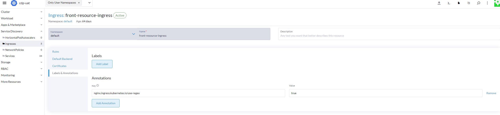
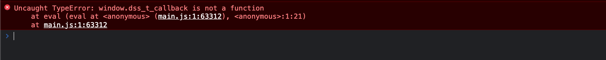

# FAQ

<br>
<br>

[[toc]]

## PVC 要选择什么类型，一定必须是 NFS 类型的吗？

<br>

> PVC 的类型可以是任意类型，这里建议是`NFS`类型只是为了能够支持**多主机读写功能**。
> 如果是采用独立部署模式的话， 那么`PVC`的类型必须支持**多主机读写功能**的类型才行。否则的话，没有任何要求。

<br>
<br>
<br>

## 为什么我在 Ingress 配置了`/__`，依旧没办法访问`__debug__`页面？

<br>

> 目前`rancher 2.6`以上的版本中的`Ingress`是不会进行正则匹配的，因此我们需要手动配置`/__debug__`的转发才行。
> 我们也可以通过开启正则匹配模式使得我们只需单独配置`/__`便可进行访问。
>
> 开启方式：
>
> `Service Discovery` -> `Ingresses` -> 找到对应的`Ingress` -> 编辑 -> `Labels & Annotations` -> `Annotations` -> 添加`nginx.ingress.kubernetes.io/use-regex`, 值为`true`;

<br>



<br>

::: warning
该规则的`pathType`必须为`ImplementationSpecific`, 如果为`Prefix`的话， 需要将`/__`修改成`/__*`
:::

<br>
<br>
<br>

## 怎么部署微前端环境？

参考以下链接

- [部署](./deploy.md)
- [一键部署](./deploy.md)
- [微前端部署](https://pro.coolcollege.cn/#/course/enterpriseCourse?courseId=1857187442596122624&taskId=)

<br>
<br>
<br>

## 旧项目怎么迁移到微前端？

参考以下链接

- [子应用集成](./integration.md.md)
- [基座 API](./api.md)
- [迁移文档](../blog/migrate-micro/index.md)
- [微前端迁移](https://pro.coolcollege.cn/#/course/enterpriseCourse?courseId=1857187442596122624&taskId=)

<br>
<br>
<br>

## 本地怎么开发？

> 在我们的微前端环境部署完成以及应用接入微前端之后，只需要访问`/__debug__`页面，添加对应的子应用信息即可

- [部署](./deploy.md)
- [一键部署](./deploy.md)
- [微前端部署](https://pro.coolcollege.cn/#/course/enterpriseCourse?courseId=1857187442596122624&taskId=)

<br>
<br>
<br>

## 标品的 DSP 升级到微前端，我们其他应用也要一起升级到微前端吗？对我们有什么影响？

> 我们旧的架构使用的是多页应用，不会影响其他应用，因为每个应用都是独立运行的;
>
> 新的 DSP 需要按照微前端的方式进行部署，除此之外构建、本地调试以及个别组件也有相对应的调整。但是整理而言侵入度不高，基本上我们依旧可以按照原来的方式进行开发

<br>

- [渐进式系统升级方案](./advanced/migration.md)

<br>
<br>
<br>

## Safari 无法进行本地调试？

Safari 等部分浏览器安全规则比较严格，会阻止混合 HTTP 请求。因此，你需要开启 HTTPS 模式，并手动打开子应用页面信任一下。

详见 [本地调试](./integration.md#10-本地调试)

<br>
<br>
<br>
<br>

## 地图无法正常加载？

子应用无法使用腾讯地图、百度地图？报跨域问题。

<br>

原因说明：子应用是在沙箱下运行的，这会导致子应用中的 `<script></script>` 等资源加载会被转换成 [`fetch`](https://developer.mozilla.org/en-US/docs/Web/API/Fetch_API/Using_Fetch) API 形式加载。那么就会出现跨域。

解决办法：

1. 对于我们自己能控制的应用，我们直接加上 CORS 报头就行了，比如 `'Access-Control-Allow-Origin': '*'`
2. 对于第三方应用
   a. 可以使用 [bay.addExcludeAssetFilter](./api.md#38-基座) 添加过滤规则。**基座内部已经添加了 `百度地图`、`腾讯地图`、`高德地图` 的过滤规则**
   b. 然而事情还没那么顺利

   

   <br>

   问题代码：

   ```js{6}
   function initialization() {
     return new Promise(function (resolve, reject) {
       if (MAP_CONST.maps) {
         resolve(MAP_CONST.maps);
       } else {
         window.dss_t_callback = function () {
           MAP_CONST.maps = window.qq.maps;
           resolve(MAP_CONST.maps);
           delete window.dss_t_callback;
         };
         const script = document.createElement('script');
         script.type = 'text/javascript';
         script.src = '//map.qq.com/api/js?v=2.exp&callback=dss_t_callback&key=' + AK;
         script.onerror = reject;
         document.head.appendChild(script);
       }
     });
   }
   ```

   `window.dss_t_callback` 这个'全局变量'实际仅存在于子应用的沙箱中, 而地图的代码在基座上运行，自然会找不到沙箱中的 ’全局变量‘。

   解决办法就是将变量暴露到真正的'全局变量'中:

   ```js{8-11}
   import bay from '@wakeadmin/bay';

   function initialization() {
     return new Promise(function (resolve, reject) {
       if (MAP_CONST.maps) {
         resolve(MAP_CONST.maps);
       } else {
         bay.addGlobalVariable('dss_t_callback', function () {
           MAP_CONST.maps = window.qq.maps;
           resolve(MAP_CONST.maps);
         });
         const script = document.createElement('script');
         script.type = 'text/javascript';
         script.src = '//map.qq.com/api/js?v=2.exp&callback=dss_t_callback&key=' + AK;
         script.onerror = reject;
         document.head.appendChild(script);
       }
     });
   }
   ```
