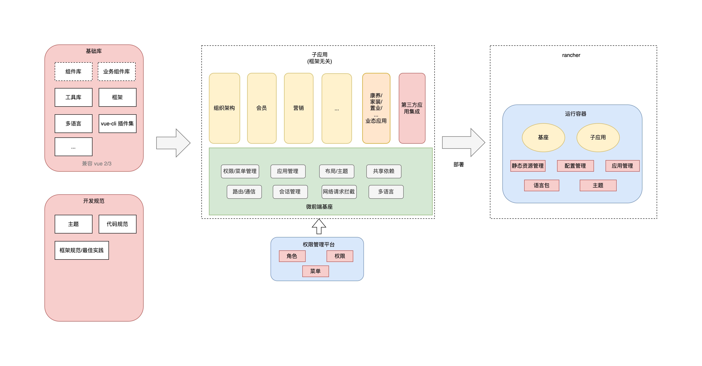
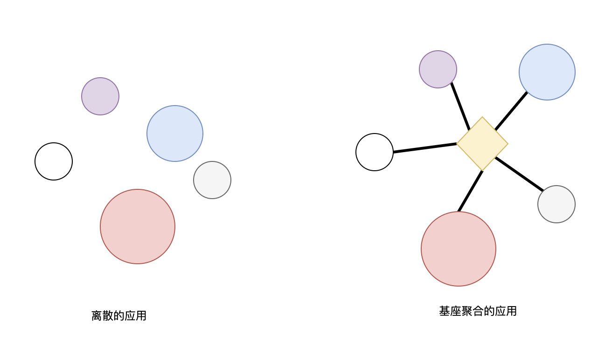

# 微前端

 

[[toc]]

 

## 微前端的定义

 

关于微前端的定义、讨论和实施方案，互联网上有成吨的资料。我们这里就不多讲的。

以下是 Micro Frontends 上的解释:

> Techniques, strategies and recipes for building a modern web app with multiple teams that can ship features independently. -- Micro Frontends
>   
> 微前端是一种多个团队通过独立发布功能的方式来共同构建现代化 web 应用的技术手段及方法策略。

 

以下摘抄自 [`single-spa`](https://zh-hans.single-spa.js.org/docs/microfrontends-concept/) 解释：

 

> **微前端是指存在于浏览器中的微服务。**   
> 微前端作为用户界面的一部分，通常由许多组件组成，并使用类似于 React、Vue 和 Angular 等框架来渲染组件。每个微前端可以由不同的团队进行管理，并可以自主选择框架。

 
 

**每个公司选择微前端方案都有自己的一些动机，一些耳熟能详的原因**：

 

- 项目体量大，需要解决运行、工程管理上的效率或成本出现瓶颈。使用微前端方案对'巨石'应用进行拆解, 每个`子应用`具备完全自主权:

  - 可以拥有独立的仓库，可以由独立的团队开发维护，独立部署升级。
  - 可以根据场景独立选型
  - 独立运行，独立维护自身的状态和资源

- 技术栈无关
- 老旧系统的集成
- 相比多页应用，微前端方案用户体验更加好
- ...

 
 

## 那我们期望微前端来解决什么痛点呢？

 

B 端业务系统经过长期、多团队、多业态的迭代，积累了大量的技术债。

- 技术栈老旧，开发效率低，我们想要应用新的技术和规范，但碍于项目体量大，本身项目质量就差，就难以维护，重构很难实施。
- 子应用的拆分没有固定的范式。有些模块按照团队拆分出独立的仓库，有些仓库则采用 MonoRepo。前者仓库之间存在大量重复代码、缺乏管理；而后者 MonoRepo 则越来越臃肿, 职责不清晰，编译缓慢, 逐渐也演变成了`巨石应用`。
- 基于多页的子应用缺乏管理，规范/标准不统一。无法统一控制视觉呈现、共享的功能和依赖。造成重复工作
- 新旧项目、第三方应用集成都很复杂。
- 多行业、多团队的项目特性，导致工程管理复杂，扩展性差。
- ...

 
 

::: info

看看大家的[吐槽](https://wakedata.notion.site/bf2cdd244244490b8d6ef5b4c8d415f0)

:::

 
 
 
 
 

## 概览

我们采用了基于`路由分发` + `基座形式`的微前端方案。整体项目架构如下：

 

 

### 1. 基础库

我们将每个应用都重复的工作提取出来，重新设计，并严格管理起来。使之能真正有效地服务业务开发，避免重复造轮子。 以下是[基础库](../base/index.md)的仓库矩阵：

 

 

 

 
 
 

### 2. 面向 Vue 3

 

惟客 B 端技术栈主要还是 Vue 为主。我们现在也鼓励在新的项目中引入 [Vue 3](https://vuejs.org/)，或者将一些体量较小的项目[迁移到 Vue 3](./vue3.md)。

 

我们的基础库、微前端基座在设计时考虑了 Vue 的跨版本兼容问题, 大部分版本库兼容 Vue 2 / 3。

 
 
 
 

### 3. 开发规范

同时，我们期望提供更丰富的开发规范、指导、最佳实践。让开发者走更少的弯路。

 

### 4. 权限管理平台

基座的**菜单**、**权限信息**来源于`权限管理平台`, 通过权限管理平台可以灵活地给不同业态、不同角色配置不同的菜单和权限。是微前端方案的重要基础。

 
 
 

### 5. 基座

基座是微前端应用集成的一个重要平台。同时也肩负着管理公共资源、依赖、规范的责任。

 

**惟客云基座主要功能：**

- 子应用集成, 给子应用提供渲染容器
- 路由/菜单管理
- 权限管理
- 主题管理
- 会话管理
- 多语言管理
- 共享依赖

 

基座主页面:

如上图，基座会提供一个基本的页面框架，而子应用则负责蓝色部分业务功能的渲染。

 
 

**使用微前端方案，可以获得以下好处**:

 
 

- **离散的应用结构，转换为星状结构**, 基座可以统一管理子应用。
- **开发者可以更专注于业务的开发**。基座会提供配套的权限管理、菜单管理、路由管理、主题管理等方案，子应用只需关心业务功能本身的开发。
- **更容易地集成应用**。不管是自己的业务应用、老旧系统、还是外部第三方应用，都可以在极少改动的情况下集成进来。
- **视觉统一**。
- **拆分巨石应用，按照业务聚合**。让应用更轻量、更可维护

 
 
 
 

### 6. 运行容器

[运行容器](./deploy.md) 是我们提供的一套微前端的运行和部署方案。相比传统纯粹的前端静态资源部署，我们希望在部署阶段可以做更多的事情：

- 动态配置。比如域名配置、SEO 信息配置
- 主题管理。一键换肤能否实现？
- 子应用管理。能否自动发现，而不是在微前端基座中硬编码？
- 语言包。能否实时配置语言包，而不需要重新编译代码、审核、发布...
- 开发环境、测试环境部署能否简化？

得益于运行容器，我们可以实现前端部署的标准化，实现[一键部署](./advanced/deploy-quickly.md)等能力。

 
 
 
 

## 扩展阅读

- [微前端](https://wakedata.notion.site/d00432a28c7142fba12f17d8190e6d15)
- [single spa](https://zh-hans.single-spa.js.org/docs/microfrontends-concept/)
- [qiankun](https://qiankun.umijs.org/zh/guide)
- [微前端在美团外卖的实践](https://tech.meituan.com/2020/02/27/meituan-waimai-micro-frontends-practice.html)
