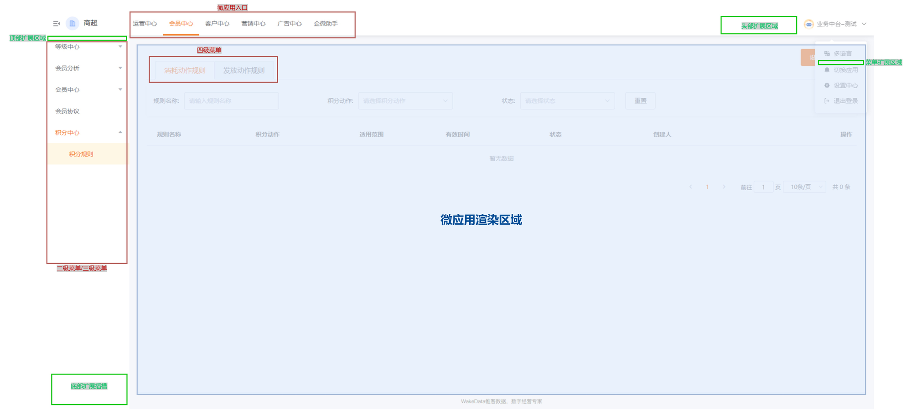
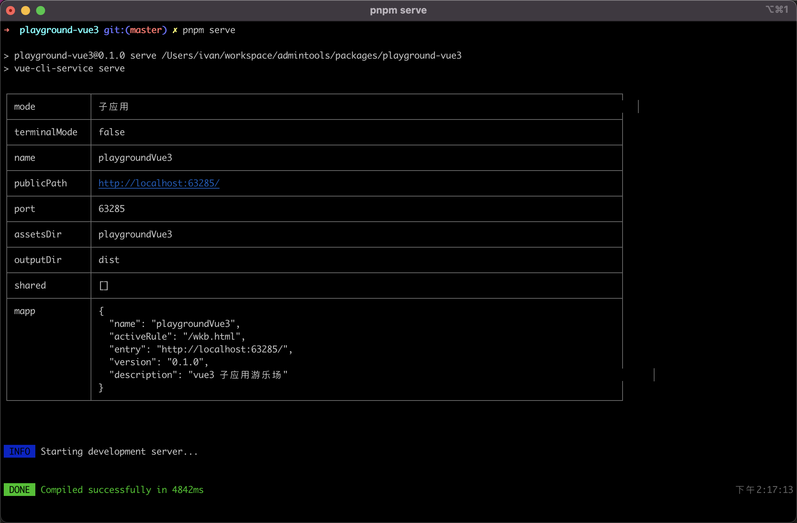
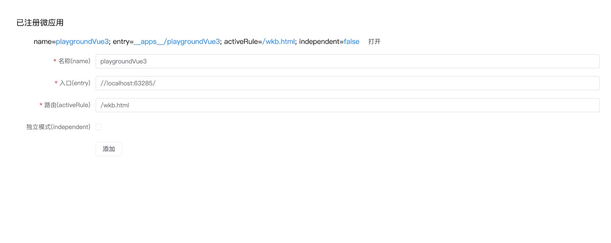

# 子应用集成

<br>
<br>

[[toc]]

<br>
<br>

现有系统集成到我们的微前端方案，并不需要大刀阔斧的重构，更多的是做'减法'。很多东西都不需要了。

<br>
<br>

::: tip

注意。下文大部分`改造步骤`都是可选的，或者只是最佳实践。微前端基座并没有严格要求子应用必须调用它提供的 API 或者组件，这些完全是可选的。

<br>

最小化的改造只会涉及`菜单隐藏`、`子应用注册`等步骤， 详见 [外部系统集成](./advanced/external-integration.md)。

:::

<br>
<br>

## 1. 统一使用 vue-cli 5+

<br>

`vue-cli` 是惟客规范定义的 B 端构建工具。**第一步请确保你的项目使用 vue-cli, 并升级到 vue-cli 5+**

<br>

::: danger
未来可能支持 vite，但是目前 vite 在 qiankun 微前端框架下并不能完美使用。敬请期待我们后续的更新
:::

<br>

::: info
这并不是说，我们只能用 vue-cli。其他构建工具也可以，只不过我们提供了 vue-cli 插件，可以更方便地让子应用集成进来, 开箱即用。
:::

<br>

相关链接：

- [Vue-cli Migrate from v4](https://cli.vuejs.org/migrations/migrate-from-v4.html)

<br>
<br>
<br>
<br>

## 2. 子应用描述信息

子应用需要在基座中注册一些关键的信息，基座才知道如何加载和渲染子应用。

<br>

| 字段名                                        | 描述                                                                                                                                          | 默认值 |
| --------------------------------------------- | --------------------------------------------------------------------------------------------------------------------------------------------- | ------ |
| :red_circle: `name: string`                   | 应用名称, 必须唯一。 如果集成的是 @wakeadmin/vue-cli-plugin-mapp-child 在控制台可以看到生成的应用名称                                         | 必填   |
| :red_circle: `entry: string`                  | 子应用的 HTML 入口, 例如 `/__apps__/vue3`, 指向微应用的静态资源的目录即可。本地开发时可以指向本地路径，例如 `//localhost:17355`               | 必填   |
| :red_circle: `activeRule: string \| string[]` | 激活的路由, 路由前缀，以 / 开始，例如 `/wkb`, 当路由以 `/wkb` 前缀时，基座会启动并渲染对应的子应用。**注意不需要包含基座 base，会自动添加**。 | 必填   |
| `container?: string \| HTMLElement`           | 挂载的 DOM 节点, 默认为 #root。这个通常由基座提供挂载点，保持默认就行了                                                                       | #root  |
| `props?: Record<string, any>`                 | 传递给子应用的参数, 可以在这里放置一些元数据                                                                                                  |        |
| `version?: string`                            | 子应用版本号。描述信息，不会影响实际渲染                                                                                                      |        |
| `description?: string`                        | 应用描述。描述信息，不会影响实际渲染                                                                                                          |        |
| `independent?: boolean`                       | 独立模式。 一般情况下微应用都是挂载在由基座的提供的页面框架内，某些特殊场景，微应用要完全接管一个页面，比如登录。这时候就开启                 | false  |
| `routeMode?: 'hash' \| 'history'`             | [路由模式](https://router.vuejs.org/zh/guide/essentials/history-mode.html#%E6%9C%8D%E5%8A%A1%E5%99%A8%E9%85%8D%E7%BD%AE%E7%A4%BA%E4%BE%8B)    | 'hash' |
| `alias?: string`                              | 用于多业态应用，绑定到同一个身份上, 详见 [多业态应用](./advanced/polymorphic.md)                                                              |        |

<br>

其中最关键的只有三个参数: `name`、`entry`、`activeRule`。这三个参数的意义请开发者务必要清楚。

<br>
<br>

::: warning

注意，如果 `activeRule` 为数组, 那么 [`openByAppName`](./api.md#34-路由) 接口调用可能出现歧义，这时会默认打开第一个

:::

<br>
<br>

## 3. 引入子应用集成插件

<br>

安装 `@wakeadmin/vue-cli-plugin-mapp-child` 插件:

<br>

```shell
$ pnpm add @wakeadmin/vue-cli-plugin-mapp-child -D
```

<br>

并在 `vue.config.js` 中配置:

```js{7,8,9}
const { defineConfig } = require('@vue/cli-service');
const { defineMappChild } = require('@wakeadmin/vue-cli-plugin-mapp-child');

module.exports = defineConfig({
  transpileDependencies: false,
  pluginOptions: {
    ...defineMappChild({
      mapp: {
        activeRule: '/dsp.html',
      }
    }),
  },
  lintOnSave: false,
});

```

<br>

`defineMappChild` 支持以下参数:

| 名称                                  | 描述                                                              | 默认值                  |
| ------------------------------------- | ----------------------------------------------------------------- | ----------------------- |
| `name?: string`                       | 微应用名称，默认从 `package.json` name 读取，并转换为驼峰形式     | camelCase(package.name) |
| `mapp?: MappSingle \| MappMultiple[]` | 微应用描述信息                                                    |                         |
| `constants?: Record<string, string>`  | 自定义变量，详见下文 [避免硬编码配置信息](#_9-避免硬编码配置信息) |                         |

<br>
<br>

**高级参数, :warning: ` 建议保持默认值`**：

| 名称                           | 描述                                                                                                                                          | 默认值 |
| ------------------------------ | --------------------------------------------------------------------------------------------------------------------------------------------- | ------ |
| `terminalMode?: boolean`       | 是否在`微前端运行容器`下运行。微前端运行容器支持模板                                                                                          | true   |
| `CDNDomain?: string`           | CDN 域名，如果静态资源需要由 CDN 分发，则需要配置此项, 如果开启了 `terminalMode`, CDNDomain 默认为 `[%= cdnDomain ? '//' + cdnDomain : '' %]` |        |
| `baseUrl?: string`             | 主应用基础路径，默认为 '/' , 建议和主应用配置一致。如果开启了 `terminalMode`, baseUrl 默认为 `[%= removeTrailingSlash(base) %]`               |        |
| `publicPath?: string`          | 微应用 publicPath，默认为 `auto`, 即 `<CDNDomain><base>/__apps__/<name>/`                                                                     | auto   |
| `shared?: SharedDeclaration[]` | 从基座中共享的依赖，必须精确匹配。详见 [通用依赖共享](./advanced/vendors.md)                                                                  |        |

<br>

::: info
`[%= var %]` 是 [运行容器](./advanced/container.md) 的模板语法。
:::

<br>

在大部分的场景下，你只需要配置 `activeRule`、`name` 等关键信息即可。其他信息保持默认配置。

<br>
<br>

### 3.1 单页应用配置示例

<br>

```js
const { defineConfig } = require('@vue/cli-service');
const { defineMappChild } = require('@wakeadmin/vue-cli-plugin-mapp-child');

module.exports = defineConfig({
  transpileDependencies: false,
  pluginOptions: {
    ...defineMappChild({
      // 默认从 package.json 中读取
      name: 'dsp',
      mapp: {
        // 子应用的激活路由，默认为 /<name>
        activeRule: '/dsp.html',
        // 独立模式，默认为 false
        // independent: false,
        // 应用别名, 详见多业态应用文档
        alias: 'dsp';
      }
    }),
  },
  lintOnSave: false,
});
```

<br>
<br>

### 3.2 多页应用配置示例

<br>

```js
const { defineConfig } = require('@vue/cli-service');
const { defineMappChild } = require('@wakeadmin/vue-cli-plugin-mapp-child');

module.exports = defineConfig({
  // 多页应用
  pages: {
    index: 'src/main.ts',
    another: 'src/another.ts',
  },
  pluginOptions: {
    // 微前端集成配置
    ...defineMappChild({
      mapp: [
        {
          // 默认为 <packageName> + upperFirst(<entry>)
          // name: 'playgroundVue3',

          // entry 必须为上面 pages 中定义的 key
          entry: 'index',

          // 默认为 /<name>
          // activeRule: '/playgroundVue3',
        },
        {
          // entry 必须为上面 pages 中定义的 key
          entry: 'another',
          activeRule: '/playgroundVue3Another',

          // 独立模式
          independent: true,
        },
      ],
    }),
  },
});
```

<br>
<br>
<br>
<br>

## 4. 支持 Web Component 识别

<br>

基座暴露了一些 `Web Component` 给子应用使用。为了避免 Vue 将这些组件识别为 Vue 自定义组件，需要一些额外的配置。

<br>

**Vue 3 配置如下**

```shell
$ pnpm add @wakeadmin/vue-cli-plugin-ce -D
```

然后在 `vue.config.js` 中配置：

```js{2,6,8}
const { defineConfig } = require('@vue/cli-service');
const { defineCE } = require('@wakeadmin/vue-cli-plugin-ce');

module.exports = defineConfig({
  transpileDependencies: true,
  parallel: false,
  pluginOptions: {
    ...defineCE({ customElement: /wkc-/ }),
    // ... 其他配置
  },
});
```

::: info

你也可以手动配置：

```js
// vue.config.js
module.exports = {
  chainWebpack: config => {
    config.module
      .rule('vue')
      .use('vue-loader')
      .tap(options => ({
        ...options,
        compilerOptions: {
          // treat any tag that starts with ion- as custom elements
          isCustomElement: tag => tag.startsWith('wkc-'),
        },
      }));
  },
};
```

<br>

详见 [Vue 3 Web Component 指南](https://vuejs.org/guide/extras/web-components.html#using-custom-elements-in-vue)
:::

<br>

---

<br>
<br>
<br>

**Vue2 配置如下:**:

直接 `use` 基座时会自动配置

```js
import Bay from '@wakeadmin/bay';

// Bay 会自动配置 Vue.config.ignoredElements
Vue.use(Bay);
```

<br>

::: info
你也可以手动配置：

```js
Vue.config.ignoredElements = [/^wkc-/];
```

:::

<br>
<br>
<br>
<br>

## 5. 移除组件库样式

<br>

在[布局与主题](./theme.md#组件库样式包外置) 中提到: `element-ui`、`element-plus` 的样式都外置到[主题包](./advanced/theme.md)中。
因此我们建议将 element-ui/element-plus 相关的样式移除。 详见 [移除组件库样式](./theme.md#组件库样式包外置)

<br>
<br>
<br>

## 6. 挂载应用

### 6.1 Vue 2 示例

原始代码:

```js
import Vue from 'vue';

import App from './App.vue';
import router from './router';
import store from './store';

Vue.config.productionTip = false;

(new Vue({
    router,
    store,
    render: h => h(App),
  })).$mount(#)
```

<br>

调整为：

<br>

```js{10,14-55}
import Vue from 'vue';
import Bay from '@wakeadmin/bay';

import App from './App.vue';
import router from './router';
import store from './store';

Vue.config.productionTip = false;

Vue.use(Bay);

let instance: Vue;

Bay.createMicroApp({
  /**
   * 启动时被调用。全局只会调用一次。
   */
  async bootstrap(props) {
    console.log('bootstrap', props);
  },

  /**
   * 挂载, 会调用多次。
   */
  async mount(container, props) {
    console.log('mount', props);

    instance = new Vue({
      router,
      store,
      render: h => h(App),
    });

    instance.$mount(container?.querySelector('#app') || '#app');
  },

  /**
   *  卸载
   */
  async unmount(props: any) {
    console.log('unmount', props);

    if (instance) {
      instance.$destroy();
    }
  },

  /**
   * props 更新，可选
   */
  async update(props: any) {
    console.log('update', props);
  },
});
```

<br>

首先使用 `Vue.use(Bay)` 注册插件, 接着使用 `Bay.createMicroApp` 创建微应用。 这里重点关注 `mount`、`unmount` 两个生命周期。 后面基座就知道如何接管子应用的渲染了。

<br>
<br>
<br>

### 6.2 Vue 3 示例

<br>

原始代码：

```js
const router = createRouter({
  // 基座路由必须使用 hash 模式
  history: createWebHashHistory(),
  routes,
});

const app = createApp(App).use(store).use(router);

app.mount('#app');
```

<br>

调整为：

<br>

```js{11-37}
import { createApp, App as TApp } from 'vue';
import { createRouter, createWebHashHistory } from 'vue-router';
import Bay from '@wakeadmin/bay';

import App from './App.vue';
import { routes } from './router';
import store from './store';

let app: TApp;

Bay.createMicroApp({
  async bootstrap() {
    console.log('bootstrap vue3');
  },
  async mount(container, props) {
    console.log('mount vue3', props);

    const router = createRouter({
      history: createWebHashHistory(),
      routes,
    });

    app = createApp(App).use(store).use(router).use(Bay);

    app.mount(container?.querySelector('#app') ?? '#app');
  },

  async unmount() {
    console.log('unmount vue3');

    app.unmount();
  },

  async update() {
    console.log('update vue3');
  },
});
```

<br>
<br>

::: tip

你也可以使用 qiankun 原生的[导出模块挂载方式](https://qiankun.umijs.org/zh/guide/getting-started#1-%E5%AF%BC%E5%87%BA%E7%9B%B8%E5%BA%94%E7%9A%84%E7%94%9F%E5%91%BD%E5%91%A8%E6%9C%9F%E9%92%A9%E5%AD%90), 这种方式需要额外配置 webpack 的 output 配置。

:::

<br>
<br>
<br>
<br>

## 7. 调用基座 API

基座暴露了一些组件和 API 供子应用调用。

<br>

其中, 组件以 `Web Component` 形式暴露，全局可以使用，不需要额外导入，直接就可能使用:

```html
<template>
  <div class="my-page">
    <wkc-header>
      <!-- content -->
    </wkc-header>
  </div>
</template>
```

<br>

API 可以通过 `@wakeadmin/bay` 调用：

```js
import bay from '@wakeadmin/bay';

// 退出登录
bay.logout();
```

<br>

::: info
基座的详细 API，见 [基座 API](./api.md)
:::

<br>
<br>
<br>
<br>

## 8. 减法

<br>



<br>

基座负责了整个页面框架的渲染，比如侧边栏、顶部菜单栏、权限、路由管理、会话管理等等。所以子应用就没必要再处理这些事情了：

<br>

- 移除顶部菜单栏
- 移除侧边栏
- 移除权限判断相关代码
- 移除 401 跳转到登录页面（基座会全局拦截）
- 移除 检查登录状态相关代码
- [页面布局](./theme.md#几种典型的布局)使用基座提供的组件
- 移除组件库样式包
- 移除接口代理配置
- 迁移 i18n 初始化代码到 [`@wakeadmin/i18n` 或 `@wakeadmin/i18n-legacy`](../base/i18n.md)
- 移除[不必要 polyfill 代码](./advanced/services.md#polyfill-兼容包)
- ...

<br>
<br>
<br>
<br>

## 9. 避免硬编码配置信息

我们应该避免在代码中硬编码配置信息，比如域名信息、企业文案、服务器链接。而是预留模板, 在部署时通过[运行容器](./deploy.md)来配置。

::: tip

阅读本节之前，你可能需要先了解 [运行容器](./deploy.md)

:::

<br>
<br>

**1. 首先是文案信息，可以使用 assets 库或者语言包, 详见 [主题包](./theme.md#主题包)**。

<br>

**2. 对于配置信息，应该从 `process.env.*` 中获取**，比如 `publicPath` 在 vue-cli 下可以通过 [`process.env.BASE_URL`](https://cli.vuejs.org/zh/guide/mode-and-env.html#%E5%9C%A8%E5%AE%A2%E6%88%B7%E7%AB%AF%E4%BE%A7%E4%BB%A3%E7%A0%81%E4%B8%AD%E4%BD%BF%E7%94%A8%E7%8E%AF%E5%A2%83%E5%8F%98%E9%87%8F) 引用:

```diff
-// ❌ 硬编码域名信息
-const defaultImage = 'https://example.com/__apps__/myapp/test.png'
+// ✅ 通过编译常量获取
+const defaultImage = `${process.env.BASE_URL}test.png`
```

<br>
<br>

**不过，对于应用内的静态资源，不应该通过组装 URL 的形式来访问，而是通过模块导入**：

```diff
-// ❌ 通过 URL 访问应用独占的静态资源
-const defaultImage = 'https://example.com/__apps__/myapp/test.png'
+// ✅ 使用模块导入
+import defaultImage from './test.png'
```

<br>
<br>

::: tip

`@wakeadmin/vue-cli-plugin-mapp-child` 下，默认的 publicPath 是**子应用的部署目录**:

<br>

- 开发环境：`${devServer.https ? 'https:' : 'http:'}//localhost:${devServer.port}/`
- 生产环境： `[%= cdnDomain ? '//' + cdnDomain : '' %][%= removeTrailingSlash(base) %]/__apps__/${name}/`。 关于模板变量的使用详见 [部署](./deploy.md)

<br>

按照 webpack 的约定， `publicPath` 应该以 '/' 结束

:::

<br>
<br>
<br>

vue-cli 中，只有 `NODE_ENV` 和 `BASE_URL` 两个内置变量，大多数场景你还是需要`自定义变量`。 自定义变量有两种方式:

- 使用 [环境变量](https://cli.vuejs.org/zh/guide/mode-and-env.html#%E7%8E%AF%E5%A2%83%E5%8F%98%E9%87%8F)
- (推荐) 使用 `@wakeadmin/vue-cli-plugin-mapp-child` 的 `constants` 参数

<br>
<br>

假设我们要创建一个 `CDN_ORIGIN` 变量, `CDN_ORIGIN` 表示 CDN 源 URL，形式如 `https://cdn.xxx.com:port`(结尾没有 '/')

```js
// vue.config.js
const { defineConfig } = require('@vue/cli-service');
const { defineMappChild } = require('@wakeadmin/vue-cli-plugin-mapp-child');

module.exports = defineConfig({
  transpileDependencies: false,
  pluginOptions: {
    ...defineMappChild({
      // ... 其他配置
      constants: {
        CDN_ORIGIN:
          process.env.NODE_ENV === 'development'
            ? // 开发环境, 随意，可以直接用线上地址
              'https://cdn.wakedata.com'
            : // 生产环境使用模板, 通过运行容器注入
              `[%= cdnDomain ? '//' + cdnDomain : '' %]`,
      },
    }),
  },
  lintOnSave: false,
});
```

<br>

代码使用示例:

```diff
-const PREVIEW_URL = 'https://cdn.wakedata.com/resources/preview.html'
+const PREVIEW_URL = process.env.CDN_ORIGIN +  '/resources/preview.html'
```

<br>
<br>

在 [html 模板](https://cli.vuejs.org/zh/guide/html-and-static-assets.html#%E6%8F%92%E5%80%BC)中、SCSS、LESS 文件中，我们也可以使用这些变量：

<br>

```html
<html>
  <head>
    <!-- ... -->
    <!-- html-webpack-plugin 默认使用的是 lodash template 语法 -->
    <script src="<%= CDN_ORIGIN %>/resources/lib/wxapi.js %>"></script>
  </head>
</html>
```

<br>

SCSS 文件示例:

```scss
.demo {
  background-image: url($CDN_ORIGIN + '/resources/hello.png');
}
```

<br>
<br>

LESS 文件示例

```less
.hello {
  background: url('@{CDN_ORIGIN}foo.img');
}
```

<br>
<br>
<br>
<br>
<br>
<br>

## 10. 本地调试

Ok, 一切准备就绪, 开始本地调试。

我们不需要在本地启动基座、登录等页面。只需要启动子应用本身即可:

<br>



<br>

> 子应用启动后，会在控制台输出应用描述信息。

<br>

假设基座部署在 `https://bizpf-test.wakedt.cn/portal/`（测试环境、生产环境都可以）, 我们打开对应的调试页面: `https://bizpf-test.wakedt.cn/portal/__debug__`，将上面控制台输出的本地子应用的描述信息录入：

<br>



<br>

点击打开，基座就会从你配置的 `entry` 中拉取子应用。

::: danger
:boom:异常：
`Mixed Content: The page at 'https://bizpf-test.wakedt.cn/portal/wkb.html' was loaded over HTTPS, but attempted to connect to the insecure WebSocket endpoint 'ws://192.168.2.109:63285/ws'. This request has been blocked; this endpoint must be available over WSS`

<br>
解决办法：需要开启 https 模式。通常测试环境、生产环境的基座都是以 HTTPS 伺服的，这里面加载 HTTP 的资源会报以上错误。这时候我们需要开启 https 模式：

```js{6}
// vue.config.js
const { defineConfig } = require('@vue/cli-service');

module.exports = defineConfig({
  devServer: {
    https: true,
  },
  // 其他配置
});

```

:::

<br>
<br>

::: danger
:boom:异常: `GET https://localhost:63285/ net::ERR_CERT_AUTHORITY_INVALID`

需要手动打开响应链接 ‘信任’ 一下:


:::

<br>
<br>

现在打开对应的链接，比如 `https://bizpf-test.wakedt.cn/portal/wkb.html`， 渲染的就是你的子应用啦。

::: info
`本地接口代理还需要吗？`

大部分场景不需要了。因为子应用在测试/生产环境的基座下渲染，请求的接口默认就是对应环境的，不需要配置任何接口代理。

<br>

**除非你想请求测试环境没有的接口，比如代理到某个开发者的本地服务器**。这时候需要配置代理：

<br>

```js{7-15}
// vue.config.js
const { defineConfig } = require('@vue/cli-service');

module.exports = defineConfig({
  // 其他配置
  devServer: {
    proxy: ['/permission', '/wd'].reduce((prev, cur) => {
      prev[cur] = {
        target: 'http://192.168.0.108/', // 某个开发者的本地地址
        changeOrigin: true,
        secure: false,
      };

      return prev;
    }, {}),
  },
});
```

<br>

对应的接口请求也要强制走本地：

```js
const baseUrl = process.env.NODE_ENV === 'development' ? process.env.BASE_URL : '/'; // BASE_URL 就是 publicPath

const getSomething = () => {
  httpRequest(`${baseUrl}wd/xxx/xxxx`, {});
};
```

:::

<br>

::: tip
还有一个建议：
建议打开 source-map, 这样 vue 应该会更好调试:

```js
// vue.config.js
const { defineConfig } = require('@vue/cli-service');

module.exports = defineConfig({
  configureWebpack() {
    return {
      // 可以获取更好的调试体验
      devtool: 'source-map',
    };
  },
});
```

:::

<br>
<br>
<br>
<br>

## 11. 部署

最后就是部署上线了。我们现在都采用容器部署(相关教程见 [前端项目容器标准化部署](https://wakedata.notion.site/a2b1fb632eb44b68b161a38f256756db)、[单 nginx 容器生成和部署](https://wakedata.notion.site/nginx-04d45891bfc84c33b13aa75b32a530ba))。

<br>

先来创建一个 `Dockerfile` 文件：

```docker
FROM wkfe/mapp-child

COPY ./dist /data
```

<br>

很简单，就两行。接下来构建和发布建议走 Jenkins, 并在 Rancher 上部署。你可以看我们的 [Jenkins + Rancher 构建案例](../standard/build.md)。

<br>

::: tip

`wkfe/mapp-child` 的默认拷贝规则：

- `__public__` 拷贝到 `/mnt/__public__`
- 其余的拷贝到 `/mnt/__apps__`

:::

<br>

关于整个微前端项目如何部署和运行，见 [部署](./deploy.md)。

关于 `wkfe/mapp-child` 的细节，可以看[这里](./advanced/container.md#创建微前端子应用镜像)

<br>
<br>
<br>

## 12. 注册子应用

注册子应用有两种方式：

- 自动发现。当子应用部署到 `__apps__` 目录下后， [微前端运行容器](./deploy.md#运行容器) 会自动发现并注册。
- 手动注册。手动将[描述信息](#子应用描述信息)注册到[运行容器的配置文件中](./deploy.md#创建配置映射可选)

<br>
<br>
<br>
<br>

## 13. 其他

### 独立模式

将 [`independent`](#子应用描述信息) 开启后，基座会为该子应用创建一个独立的路由，这个页面由该子应用独占渲染。换句话说，就是子应用不会在`菜单框架`下渲染。

适用于登录、应用切换这类不在`主页面`下运行的页面。

<br>
<br>

::: tip

**和[全屏模式](./api.md#wkc-fullscreen) 或[无菜单模式](./api.md#wkc-menuless) 的区别**:

- 全屏和无菜单模式都是在主页面下渲染的，只不过是菜单隐藏起来了而已
- 主页面会加载菜单、检查登录状态。independent 不会执行这些逻辑

:::

<br>
<br>

### 菜单多语言

基座不会维护子应用的菜单多语言包，这个由子应用自行注册。 详见 [菜单多语言注册](./api.md#362-菜单多语言)

<br>
<br>
<br>
<br>

### 菜单图标

同样，基座提供了内置的图标，如果基座想要自定义图标也可以通过 [registerAsset 接口](./api.md#37-assets)注册。

<br>
<br>
<br>
<br>
