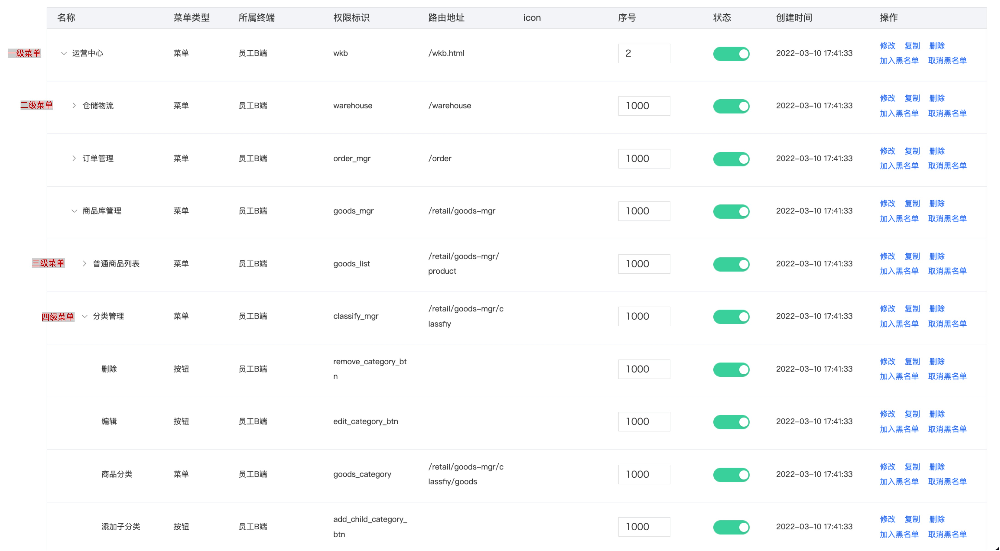
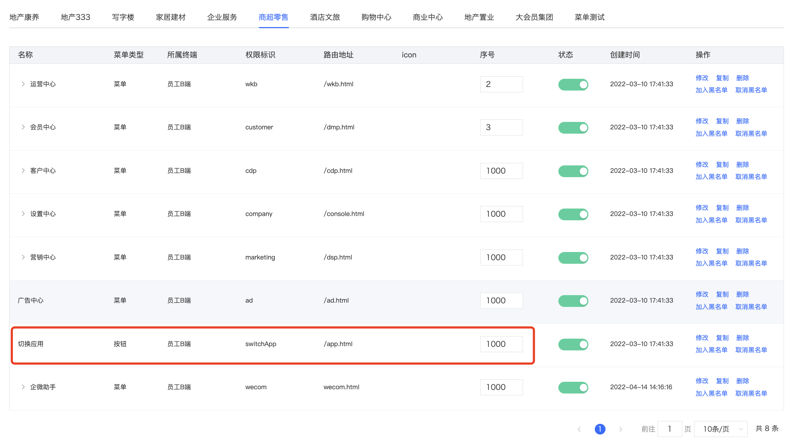
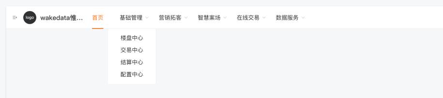
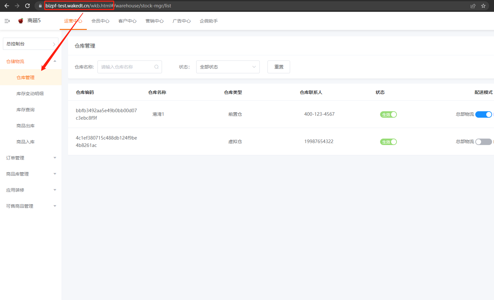

# 惟客云菜单配置

<br>
<br>

[[toc]]

<br>
<br>

## 1. 惟客云菜单配置基本概念

<br>
<br>



<br>
<br>

- **菜单层级**。

  - 最多四级。理论上权限管理平台可以创建无限级的菜单，但是没有实际意义，界面上最多能呈现四级。
  - 超出四级的菜单怎么处理？ 可以作为权限判断的依据。但是还是不建议创建超过 5 级的菜单。
    <br>
    <br>

- **菜单路由**。

  - 一级菜单为页面入口，直接和域名组合。即 path。
  - 二级及以下菜单为 [`hash` 路由](https://router.vuejs.org/zh/guide/essentials/history-mode.html#hash-%E6%A8%A1%E5%BC%8F)。

  比如 一级菜单配置为 `/wkb.html`, 二级菜单配置为 `/hello`, 那么最终的路由为 `/wkb.html#/hello`
  <br>
  <br>

- **菜单类型**

  - 按钮。通常没有绑定路由的。不会在页面呈现，可以作为权限判断的依据。
  - 菜单。绑定了路由的，但是权限管理后台并没有设置为必填。即路由可能为空。
    <br>
    <br>

- **权限标识**

  权限标识符在同一个子级是唯一的，但是一棵树中就不保证是唯一的了。所以为了唯一标志一个菜单或按钮权限。可以自上而下合并起来，比如 `wkb.warehouse.goods_mgr.goods_list` 相对来说会比较繁琐。

  <br>
  <br>

## 2. 基座菜单规范

我们对菜单配置进行了一些规范扩展，以发挥更强大的能力

<br>
<br>

### :new: 用户头像下拉列表

**顶级的按钮型菜单**，我们将放入用户头像的下拉列表中:



执行效果如下：


<br>
<br>

### :new: 顶级菜单分组

对于*顶级菜单*, 如果**没有配置路由**， 我们将会把它视为一个分组:



::: warning
相对应的，二级菜单将被视为主入口。即不是 `hash` 路由，而是 `path` 路由
:::

<br>
<br>

### :new: 菜单外挂

这是一个重要的特性。

实际需求中，我们可能会引用其他应用的页面。比如在一级菜单为 dsp 中展示 wkb 应用下的营销工具。旧的实现是通过 iframe 将 wkb 嵌入到 dsp 中, 这种实现有很多问题。

因此我们会针对这种引用其他应用页面的情况，扩展一种新的路由配置语法：

```
@{name}#{route}?{params}
```

举例： `@/wkb/#/foo/bar`。 以 `@` 开头的，说明不是 hash 路由。基座会通过智能识别切换对应的应用。

<br>

::: warning
@ 路由不能用于顶级菜单
:::

<br>
<br>

### :new: 支持外链

菜单也可以配置为外链，比如 `http://wakedata.com`。对于外链菜单，点击时会直接跳转

<br>
<br>

### :new: 支持查询字符串

菜单配置也支持附加查询字符串。基座在高亮匹配时会忽略这些查询字符串.

<br>
<br>

### :new: 图标

菜单的图标配置更加灵活，支持：

- http 链接图片
- svg 图标(标签 <svg...>)。
- [惟客云内置图标](../icons/index.md)（传入图标名即可）
- 子应用注册

<br>
<br>
<br>

### :new: 支持路由自动重定向

<br>



<br>

当路由匹配到非叶子的菜单节点时，基座会自动重定向到其下级叶子节点。

现在我们不需要在路由配置中设置 [redirect 规则](https://router.vuejs.org/zh/api/#redirect) 了。

<br>
<br>
<br>
<br>

### :new: 支持 History 路由模式

<br>

默认情况下，权限管理平台设置的下级菜单会作为 [Hash 路由](https://router.vuejs.org/zh/guide/essentials/history-mode.html#hash-%E6%A8%A1%E5%BC%8F) 处理。现在我们支持子应用声明以哪种路由模式来处理这些下级菜单。

详见 [History 模式子应用](./advanced/history)

<br>
<br>
<br>
<br>

## 3. 权限管理

上面提到了权限标识符，我们可以通过它进行权限校验，比如 `wkb.warehouse.goods_mgr.good_delete` 表示是否有权限删除商品。

我们将完整路径的权限标识符称为 `全限定权限标识符`。

<br>

`全限定权限标识符` 有一个非常大的缺陷, **就是耦合的菜单的配置方式**。假设现有的菜单:

```
- foo
    - A
        - B
					删除按钮(foo.A.B.delete)
- bar
```

我们在 B 页面中，使用全限定的权限标识符（foo.A.B.delete）来判断是否有删除权限。 现在假设 B 页面移除到 bar 下。那 B 页面硬编码绑定的 foo.A.B 就会失效了。 为了方便菜单迁移，更好的方式是通过当前的`上下文`来计算。

<br>
<br>

因此，大部分场景我们不推荐使用 `全限定权限标识符`!

<br>
<br>

**基座提供了三种权限标识符匹配方式：**

### 1. **全限定匹配**。

即完整的权限标识符匹配，这当然是支持的。

  <br>
  <br>

### 2. **模糊匹配**

权限标识在全局范围内冲突概率可能很高, 但是如果给定更多上下文，冲突的概率就会越小。 举个例子:

```
- foo
    - A
       - B
- bar
     - B
```

`B` 全局有两个，如果加上 A, `A.B` 就可以唯一锁定。

模糊匹配不要求连续的权限标识符，可以**跨级查找**。如果冲突，则会给出警告并默认选择第一个匹配项。

模糊匹配可以降低权限标识符的维护成本。

   <br>
   <br>

### 3. **上下文匹配**

上下文匹配是一个更加简便的匹配方式。假设当前正在渲染的是 `foo.A` 页面：

```
 - foo
     - A
         - add
         - remove
     - hello
         - add
         - remove
     - wakedata
 - bar
       - B
         - add
         - remove
```

在 `foo.A` 页面下，我们可以直接使用 `add`、`remove` 这些标志符来判断是否有权限, 而不需要描述完整的路径。
比如:

```html
<div>
  <wkc-allows to="add"><button>添加</button></wkc-allows>
  <wkc-allows to="remove"><button>删除</button></wkc-allows>
</div>
```

基座拿到标识符后，会在当前激活的菜单节点中查找，如果没找到就往上一级查找。 因此在 `foo.A` 页面下，`hello`、`wakedata` 也是允许的。

<br>
<br>
<br>

:::info
关于权限判断的使用，详见 [基座 API](./api.md)
:::

<br>
<br>
<br>
<br>

### 权限检查的最佳实践

<br>

- 前端代码应该依赖权限，而不是依赖角色。角色是一个可变范围的权限集，他是一个动态的概念。

<br>
<br>
<br>
