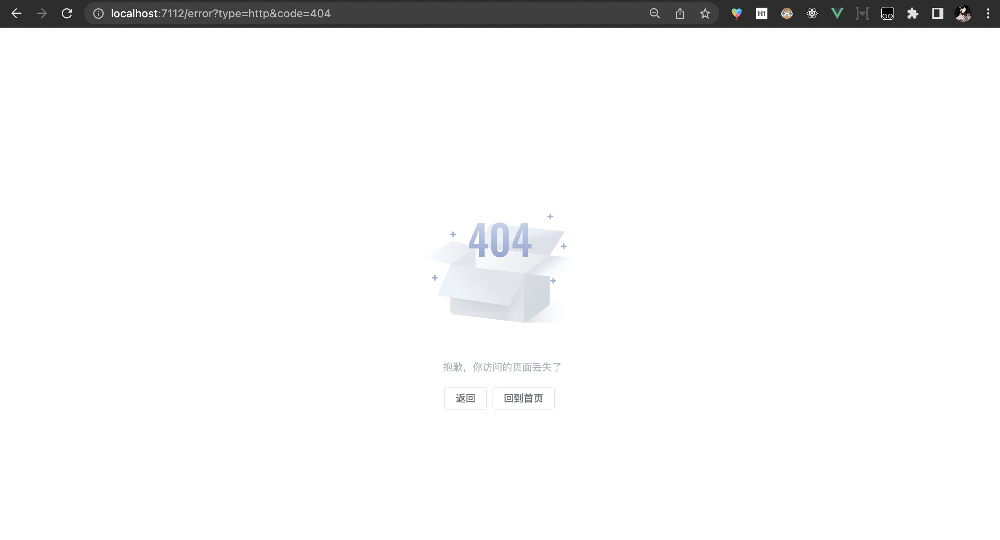
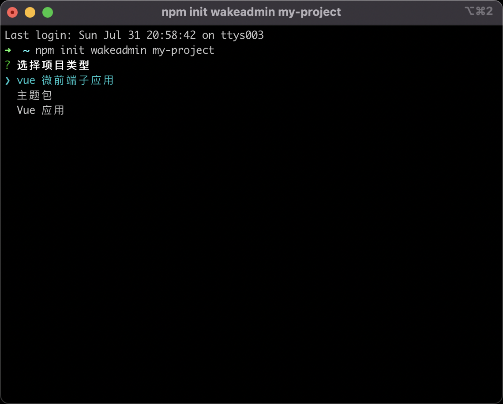
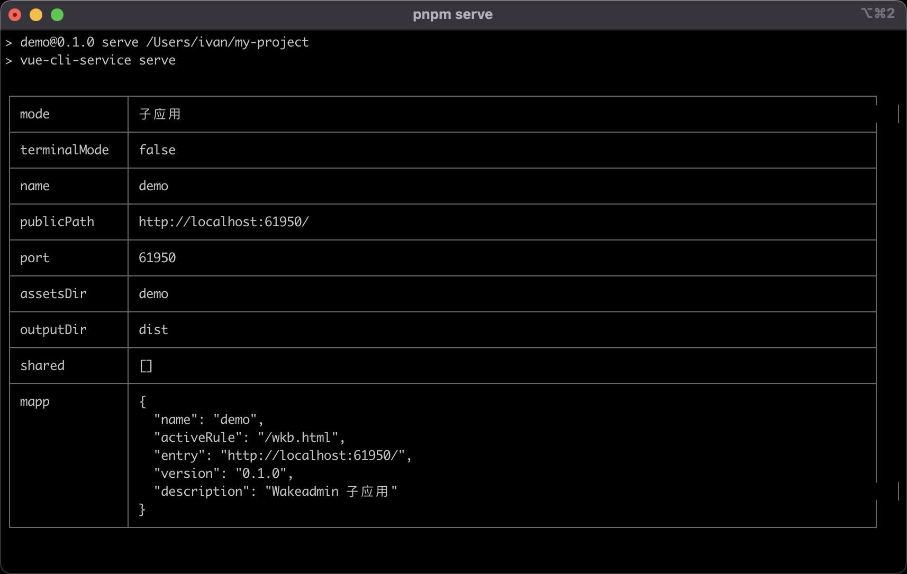
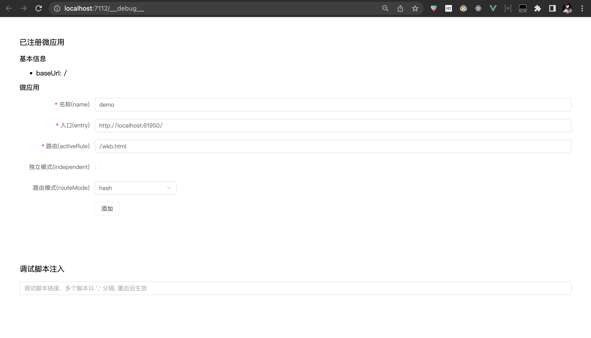
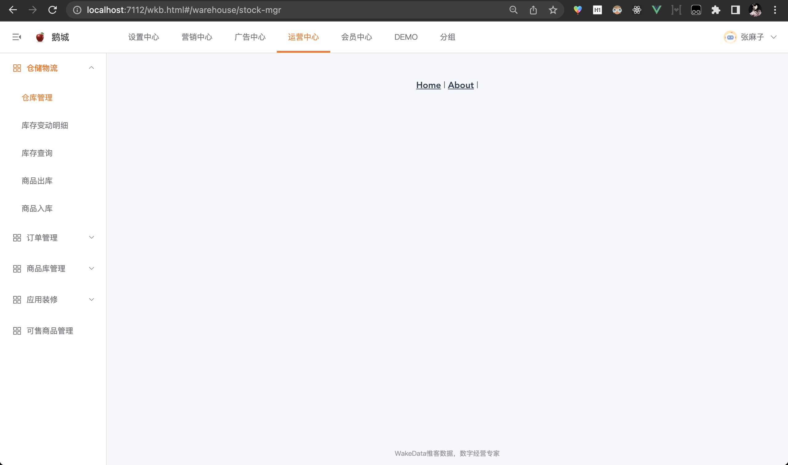
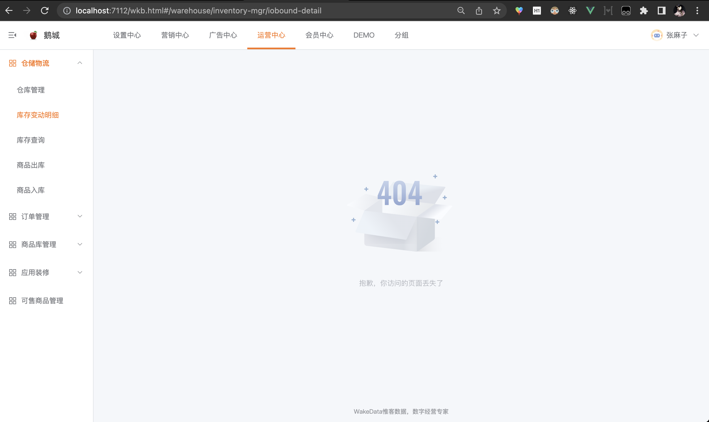

# 快速开始

<br>

本文会带领你快速创建一个微前端子应用，并集成到基座中。

<br>

## 1. 环境准备

::: tip

如果你们的开发/测试环境已经部署了微前端基座，可以跳过这一步。

:::

<br>

如果你要了解‘正式’的微前端环境搭建，可以看 [部署](./deploy.md) 一节， 这里会详细介绍微前端的运行容器、Rancher 环境的初始化等等。

<br>

如果你的环境没准备好，也不妨碍我们快速上手。我们准备了一个开箱即用的游乐场，只需一行命令:

<br>

```shell
docker run -it --rm -p 7112:80 wkfe/playground
```

<br>

启动完毕后，我们就可以在浏览器打开： `http://localhost:7112`

<br>



<br>

因为还没有挂载任何`子应用`, 所以显示的是 404 页面。不着急，现在就创建一个子应用。

<br>
<br>
<br>
<br>

## 2. 创建子应用

可以通过我们提供的[项目脚手架](../base/create-wakeadmin.md) 来快速创建一个子应用:

<br>

```shell
$ npm init wakeadmin
```

<br>



<br>
<br>

选择微前端子应用。本文以 Vue 3 微前端子应用为例。

<br>
<br>
<br>

## 3. 一些基础配置

假设我们要在 `/wkb.html` 下挂载我们的子应用，修改 `vue.config.js` 的 `defineMappChild` 参数:

```diff
// vue.config.js
module.exports = defineConfig({
  parallel: false,
  transpileDependencies: [/(wakeapp|wakeadmin)/],
  pluginOptions: {
    // 详见子应用集成：https://wakeadmin.wakedata.com/mapp/integration.html
    ...defineMappChild({
      mapp: {
-        activeRule: '/demo',
+        activeRule: '/wkb.html',
      },
    }),
    // 共享依赖： 详见: https://wakeadmin.wakedata.com/mapp/advanced/vendors.html
    ...defineVendors({
      modules: {},
    }),
    ...defineCE({ customElement: /wkc-/ }),
  },
```

<br>
<br>
<br>

## 4. 启动

<br>

```shell
$ pnpm serve
```

<br>



<br>
<br>

控制台输出了子应用的一些关键信息：

- `name` 子应用的名称。这个必须是唯一的，不能和其他子应用冲突。
- `activeRule` 子应用激活的路径。当浏览器的路径和 activeRule 匹配时，就会加载该子应用并渲染。同样 activeRule 也要避免和其他子应用冲突。
- `entry` 子应用的 html 入口。微前端基座会请求这个地址来加载子应用。

<br>
<br>
<br>

## 5. 挂载到基座中

那现在怎么挂载到基座中进行开发调试呢？ 打开 `http://localhost:7112/__debug__`

填入子应用信息：



<br>

点击`打开`就会进入主页面了:



<br>
<br>
<br>

## 6. 配置一个 404 页面试试

<br>

脚手架创建的页面只有 `/` 和 `/about` 页面，因此 `wkb.html` 下的大部分菜单路由没有找到匹配的 Vue 页面而显示空白。
我们现在改动一下，未匹配到页面时显示 404 错误:

<br>

```js{20-24}
// src/router/index.ts
import { h } from 'vue';
import { RouteRecordRaw } from 'vue-router';
import HomeView from '../views/HomeView.vue';

export const routes: RouteRecordRaw[] = [
  {
    path: '/',
    name: 'home',
    component: HomeView,
  },
  {
    path: '/about',
    name: 'about',
    // route level code-splitting
    // this generates a separate chunk (about.[hash].js) for this route
    // which is lazy-loaded when the route is visited.
    component: () => import(/* webpackChunkName: "about" */ '../views/AboutView.vue'),
  },
  {
    path: '/:pathMatch(.*)',
    name: 'notFound',
    component: () => h('wkc-error-page-not-found'),
  },
];

```

<br>
<br>

顺便干掉 `App.vue` 没用的导航栏：

```diff
<template>
  <ElConfigProvider namespace="ep">
-    <div id="app">
-      <nav><router-link to="/">Home</router-link> | <router-link to="/about">About</router-link> |</nav>
      <router-view />
-    </div>
  </ElConfigProvider>
</template>

```

<br>
<br>

Ok!, 现在未匹配的路由我们都显示 404 了：



<br>
<br>

## 7. 接下来

还有很多要学习的。

- [学习 Vue 3](./vue3.md)。不管是新项目还是旧项目，我们都推荐你引入 Vue 3 的最佳实践，来提示编程体验和项目质量。
- [菜单配置和权限管理](./menu.md)。微前端和`权限管理平台`结合起来，灵活地管理页面的展现。
- [布局与主题](./theme.md)。编写统一风格的后台页面。主题机制可以方便地应付客户的外观定制化需求。
- [子应用集成](./integration.md)。深入了解子应用如何集成到微前端基座，以及已有的项目如何迁移到微前端。
- [部署](./deploy.md)。我们现在可以在部署阶段做更多事情。了解如何部署整套微前端环境。

<br>
<br>
<br>

基础功能学完后，可以深入学习“高级”相关话题，以应付更复杂的开发场景。

<br>
