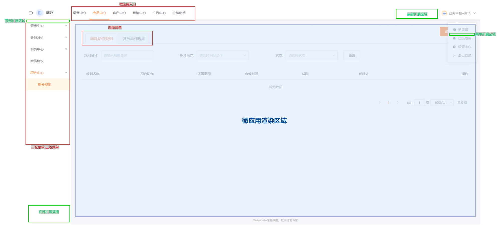
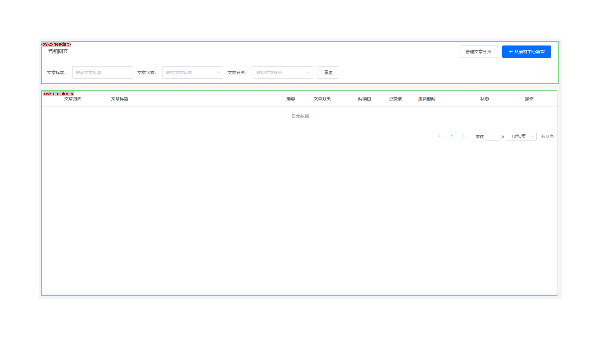

# 布局与主题

<br>
<br>

基座的一个重要职能就是统一整个 PC 端管理后台的视觉呈现。

在旧的系统中，主题、布局组件重复和分散在各个子应用中，这导致更新维护起来比较麻烦，常常会出现视觉不统一的情况。

举个例子，在项目交付时，需要针对客户的需求和企业特色定义视觉，旧的系统中，我们需要对每个子应用都进行更新，然后再打包部署。这种工作繁琐且无聊。

<br>

**:new: 现在由我们的基座来做这件事情，我们甚至可以做到不停机一键切换。**

<br>
<br>

为了实现主题的灵活配置，基座做了以下调整：

- [1. 统一定义的 CSS 变量](#统一定义的-css-变量) CSS 变量是运行时变量，而 SCSS、Less 变量需要静态编译
- [2. 组件库样式包外置](#组件库样式包外置) 组件库的样式包不再编译并内嵌在基座和子应用中, 从而实现按需插拔
- [3. 统一提供布局组件](#统一提供布局组件) 提供了一系列布局组件，简化子应用开发的同时，保证视觉的统一
- [4. 主题包机制](#主题包) 主题包是一个提供 CSS、JS 以及相关静态资源的 npm 包。配合我们的[`微前端运行容器`](../mapp/deploy.md), 可以实现一键挂载

<br>
<br>

## 统一定义的 CSS 变量

我们根据 [惟客 PC 端的视觉规范](https://codesign.qq.com/s/GyOl9yVmqn0dxaW/OD8r0BXKByjRXkg) 定义了[一套 CSS 变量集](../theme/color.md)

<br>
<br>


<br>
<br>

**我们规定： 无论什么时候，你都应该优先使用这套[CSS 变量集](../theme/color.md), 而不是:**

- 引用 `SCSS`/`Less` 的静态变量
- 引用 `ElementUI` 这些组件库暴露出来的变量
- 硬编码主题色

<br>

:::danger
**为什么不推荐引用 `SCSS`/`Less` 的变量?**
<br>
因为这些变量是静态的，调整这些变量需要重新编译。

而 CSS 变量集由`主题包`提供，并挂载在基座中，这些变量支持运行时修改和切换, 子应用不需要变更任何代码。
:::

<br>

:::danger
**为什么不推荐引用 `ElementUI`/`ElementPlus` 的变量?**

我们的提供的变量更加中立，不耦合任何框架。维护起来更轻松。
:::

<br>
<br>

## 组件库样式包外置

为了实现主题动态切换，**子应用、基座都不需要再导入 element-ui、element-plus 等相关组件库的 CSS 样式表。而是外置到主题包中维护**。

因此，子应用集成到基座时应该把相对应的组件库样式导入移除:

:::info

element-ui

<br>

```diff
-import 'element-ui/lib/theme-chalk/index.css';
```

同时 wkb-common-ui 也废弃了:

```diff
-import 'wkb-common-ui/style';
-import 'wkb-common-ui/packages/theme-chalk/src/index.less'; // 引入wkb-common-ui中的自定义样式
```

:::

<br>

:::info

element-plus

完整导入，移除:

```diff
-import 'element-plus/dist/index.css'
```

如果是 `element-plus`，且使用到了[按需组件导入](https://element-plus.gitee.io/zh-CN/guide/quickstart.html)的功能，需要关闭样式导入：

```diff
// webpack.config.js
const AutoImport = require('unplugin-auto-import/webpack')
const Components = require('unplugin-vue-components/webpack')
const { ElementPlusResolver } = require('unplugin-vue-components/resolvers')

module.exports = {
  // ...
  plugins: [
    AutoImport({
-      resolvers: [ElementPlusResolver()],
+      resolvers: [ElementPlusResolver({importStyle: false})],
    }),
    Components({
-      resolvers: [ElementPlusResolver()],
+      resolvers: [ElementPlusResolver({importStyle: false})],
    }),
  ],
}
```

如果是手动导入，则不需要再安装 [`unplugin-element-plus`](https://github.com/element-plus/unplugin-element-plus) 插件了。

:::

<br>
<br>

:::warning
还有一个重要的事情。我们推荐新的项目使用 vue3 + element-plus, 但是，element-ui、element-plus 的样式并不兼容。
在较长的一段时间内，我们的系统可能会并存 element-ui、element-plus。

为了避免样式冲突，我们规定，element-plus 统一使用 `ep` 命名空间, 因此你的子应用需要做以下配置:

```diff
import { RouterView } from 'vue-router';
+import { ElConfigProvider } from 'element-plus';

export default () => (
+  <ElConfigProvider namespace="ep">
    <RouterView />
+  </ElConfigProvider>
);

```

:::

<br>
<br>
<br>
<br>

## 统一提供布局组件

惟客管理后台在布局上有规范的定义。现在基座实现了这些定义，并通过 `Web Component` 的形式暴露到子应用使用

<br>

:::info
布局组件的详细 API 说明，见 [基座 API](./api.md)
:::

<br>

### 扩展插槽



<br>
<br>

基座提供了一些组件，供子应用扩展主界面的一些内容：

<br>

| 组件名称                 | 描述               |
| ------------------------ | ------------------ |
| wkc-header-slot          | 头部扩展插槽       |
| wkc-header-dropdown-menu | 头像下拉列表扩展   |
| wkc-sidebar-top-slot     | 侧边栏上方扩展插槽 |
| wkc-sidebar-bottom-slot  | 侧边栏下方扩展插槽 |

<br>

使用示例：

```html
<template>
  <div>
    <wkc-sidebar-bottom-slot>
      <div slot="collapse">折叠显示</div>
      <div slot="expand">展开显示</div>
    </wkc-sidebar-bottom-slot>
  </div>
</template>
```

<br>

::: warning

注意：`wkc-*` 是 Web Component 组件，slot 的使用方式和 vue 有些差别，必须使用 slot 属性，且不能用于 template

:::

::: warning
让 Vue 识别 Web Component 组件需要一些额外的配置, 详见 [子应用集成](./integration.md)
:::

<br>
<br>
<br>

### 几种典型的布局

我们看几种典型的布局，在新的微前端体系之下怎么编写。

<br>
<br>

#### 1. 内容筛选 + 四级菜单页面


这是一个典型的表格页面，包含内容筛选区、内容区等。另外这是一个四级页面，因此头部以 Tab 的形式渲染。
基座提供了 `<wkc-header>`、`<wkc-content>` 组件来满足这种需求：

```html
<template>
  <div class="my-page">
    <wkc-header>
      <!-- 扩展操作区域 -->
      <el-button slot="extra"><wkc-icon icon="Add"></wkc-icon> 新建图文</el-button>

      <el-form>
        <!-- 这里是内容筛选表单 -->
      </el-form>
    </wkc-header>

    <wkc-content>
      <fat-table><!-- 表格区域 --></fat-table>
    </wkc-content>
  </div>
</template>
```

<br>
<br>

这就行了。 如果是四级页面 `<wkc-header>` 会自动渲染 Tab 菜单。尽管如此，你依旧可以使用 title 来设置自定义标题。

<br>
<br>
<br>

#### 2. 内容筛选 + 三级菜单页面



<br>

这种情况和上述例子一样。`<wkc-header/>` 会自动处理。

<br>
<br>
<br>

#### 3. 简单内容


<br>
<br>

简单的内容页面，没有筛选区。底部有一个悬浮操作栏。实现例子:

```html
<template>
  <div class="my-page">
    <wkc-header>
      <!-- 可选，如果要复杂的标题渲染可以使用 title slot。默认情况基座会拿菜单配置的标题 -->
      <span slot="title">小程序设置</span>
      <el-button slot="extra">恢复导航</el-button>
    </wkc-header>
    <wkc-content><!-- 内容区 --></wkc-content>

    <!-- 浮动底部栏 -->
    <wkc-float-footer><el-button>保存</el-button></wkc-float-footer>
  </div>
</template>
```

<br>
<br>
<br>
<br>

#### 4. 全屏页面


全屏的页面，比如应用装修。可以使用 `<wkc-fullscreen></wkc-fullscreen>` 包裹

<br>
<br>
<br>
<br>

#### 5. 表单/预览页面


典型的表单、预览页面，实现例子:

```html
<template>
  <wkc-header title="商品入库">
    <wkc-breadcrumb />
    <!-- 表单内容 -->
  </wkc-header>
</template>
```

<br>
<br>
<br>
<br>

#### 6. 错误页面


基座也内置了错误页面，供子应用使用:

```html
<template>
  <!-- 默认 404 -->
  <wkc-error-page-not-found />
</template>

<template>
  <!-- 默认 403 -->
  <wkc-error-page-forbidden />
</template>

<template>
  <!-- 默认 403 -->
  <wkc-error-page :image="可选，支持自定义图片" description="发现外星人">详细描述坐标</wkc-error-page>
</template>
```

<br>
<br>
<br>
<br>

#### 7. 自定义


<br>

自定义布局？ 完全可以，基座并没有限制子应用应该渲染什么内容。

<br>
<br>
<br>
<br>

## 主题包

我们定义了一套主题包机制，配合[微前端运行容器](./advanced/container.md)实现主题动态切换。

<br>

通过主题包可以定制以下内容：

- 主题变量
- 组件库样式、页面样式
- 图片(比如 Logo)、文案
- 语言包
- 扩展 Javascript 代码
- 其他[配置参数](./deploy.md)

<br>

::: warning
注意: 无法通过主题包覆盖某些 Vue 页面，我们认为这些需求属于定制化需求。主题包仅限于样式、文案等层面的干预
:::

<br>
<br>

### 如何定制文案、图片等静态资源？

在基座中，我们使用 `@wakeadmin/assets` 库来实现。 比如基座中的 Logo 是这样定义的：

```jsx{9}
// ....
import DEFAULT_LOGO from './logo-default.png';

export const Header = defineComponent({
  name: 'BayHeader',
  async setup() {
    // ...

    const defaultLogo = useAsset('IMG_BAY_LOGO', DEFAULT_LOGO);

    return () => {
      // ....

      return (
        <header class="bay-header">
          <div class="bay-header__before">
            <div class="bay-header__logo">
              
              <span class="bay-header__logo-name">{name}</span>
            </div>
          </div>
        </header>
      );
    };
  },
});
```

<br>
<br>

`assets` 有点像`依赖注入`。 可以用于定义任何文本类型的 **`主题扩展点`**, 比如图片、文案、路由。以下是基座目前定义的扩展点，后面随着需求的迭代，会有更多扩展点暴露出来:

- `IMG_BAY_FAVICON`: favicon
- `IMG_BAY_LOGO`: logo
- `IMG_BAY_AVATAR`: 头像
- `IMG_BAY_ERROR`: 默认错误图片
- `IMG_BAY_APP_LOADING`: 应用加载中图片
- `IMG_BAY_ERROR_404`: 默认 404 错误图片
- `IMG_BAY_ERROR_403`: 默认 403 错误图片
- `URL_LOGIN`: 登录页面路由

<br>

::: tip

**命名规范**

<br>

`<TYPE>_<MODULE>_<NAME>`

-     TYPE: 类型，如 IMG、ICO、TXT、URL 等等。
-     MODULE: 模块名称，如 BAY
-     NAME: 资源命名

:::

<br>
<br>

那怎么配置这些 `assets` 呢？ 这个依赖于我们的`微前端运行容器`(这个会在 [部署](./deploy.md) 中介绍)。可以通过[运行容器](./deploy.md)的配置文件来进行配置:

<br>

- 方式 1： 在[主题包](./advanced/theme.md) 中定义 `config.yml`
- 方式 2： 在[运行容器](./deploy.md)（通常是 `Rancher` 上的[`配置映射`](./deploy.md#创建配置映射-可选)）中定义 `config.yml`

<br>

配置示例:

```yaml
# config.yml
assets:
  IMG_BAY_LOGO: '<BASE_URL>/__theme__/logo.png'
  TXT_BAY_FOOTER: '版权归惟客所有'
```

<br>

**我们也推荐在子应用中也应用这套方案。**

<br>
<br>
<br>

### 语言包

如果对应的文案启用了多语言，那么可以在主题包中定义语言包来进行覆盖。 详见 [主题包定制](./advanced/theme.md)。

基座预定义的语言包可以查看[这里](http://gitlab.wakedata-inc.com/wakeadmin/tools/-/tree/master/packages/bay/src/i18n)。

<br>
<br>
<br>

关于**自定义主题包**的话题，移步到 [主题包定制](./advanced/theme.md)。
