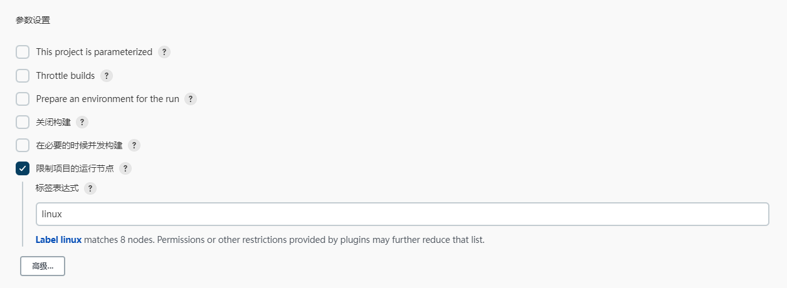
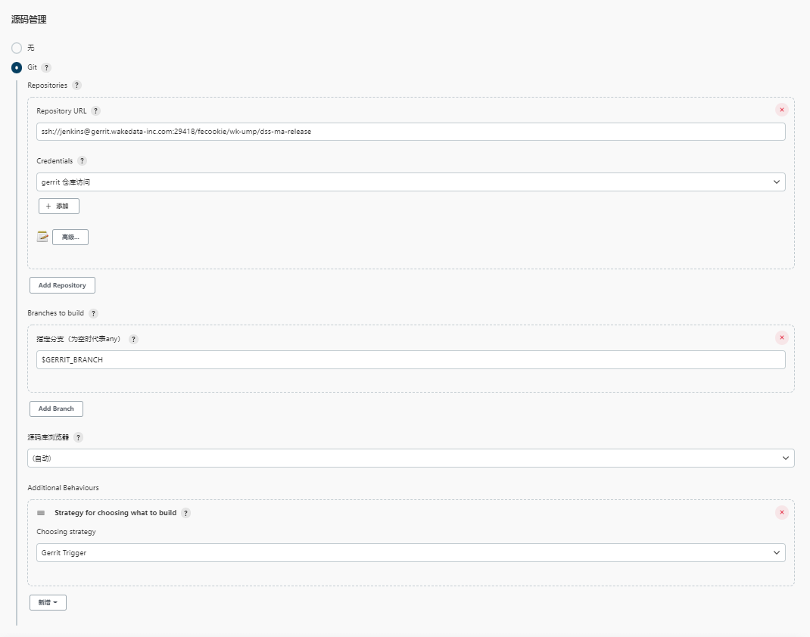

# Jenkins 自动化构建、部署范例

<br>
<br>

[[toc]]

<br>
<br>

::: tip

本范例以 [fecookie/wk-ump/dss-ma-release](http://gerrit.wakedata-inc.com/q/project:fecookie%252Fwk-ump%252Fdss-ma-release) 为例：

- [Jenkins 构建 Job](http://jenkins.wakedata-inc.com/view/%E4%BA%A7%E7%A0%94%E5%89%8D%E7%AB%AF%E9%95%9C%E5%83%8F%E6%9E%84%E5%BB%BA/job/build-ma/)
- [Jenkins 检查 Job](http://jenkins.wakedata-inc.com/job/check-fecookie-wk-ump-dss-ma-release/)

:::

<br>

::: tip

推荐使用我们提供的[项目脚手架](../base/create-wakeadmin.md)来创建项目:

```shell
$ pnpm create wakeadmin
```

:::

<br>
<br>
<br>

## 1. 命名规范

Jenkins Job、Rancher 工作负载、容器我们都定义了[命名规范](./docker.md)。后面请严格遵循命名规范。

<br>
<br>
<br>

## 2. 目录组织

```shell
  dist/                  # 静态资源产出目录
  scripts/               # 构建脚本
    check.sh             # 代码规范检查
    build.sh             # 项目构建
    docker-build.js      # Docker 镜像构建
    docker-publish.js    # Docker 镜像发布
    rancher-update.js    # 开发环境、测试环境 Rancher 更新
    shared.js            # 共享工具类

  Dockerfile             # Docker 构建描述
  .dockerignore          # 一定要忽略掉 node_modules

```

<br>
<br>
<br>
<br>

## 3. 脚本示例

### 3.1 代码检查

```shell
#!/usr/bin/env bash

set -e
set -x

# 规范检查

env
node -v

npm i -g pnpm
pnpm -v
pnpm install

# 构建
pnpm run --if-present build

# 规范检查
pnpm wkstd gerrit-check

# 单元测试
pnpm run --if-present test
```

<br>
<br>

- 新项目推荐[使用 pnpm](https://pnpm.io/zh/cli/install)
- 执行构建。确保每一个提交都能通过构建
- 使用 [wkstd 进行自动化检查](https://wakedata.notion.site/d223981cad664edab0c89fd269aa751d#3895cb4d632e4f789d48651d5d79330a)
- 如果有单元测试也在这里执行

<br>
<br>
<br>
<br>

### 3.2 代码构建

```shell
#!/usr/bin/env bash

set -e
set -x

# 容器构建
# 需要提供以下参数
# DOCKER_USER docker 用户
# DOCKER_PASSWORD docker 用户密码

if [ "$STAGE" = 'PRODUCTION' ]; then
  export DOCKER_SERVER=ccr.ccs.tencentyun.com
else
  export DOCKER_SERVER=172.26.59.200
fi

env
node -v

npm i -g pnpm
pnpm install

# 构建静态资源
pnpm build

# 构建镜像
node ./scripts/docker-build.js

# 发布
node ./scripts/docker-publish.js

# 触发 Rancher 更新
node ./scripts/rancher-update.js
```

<br>

- 要发布镜像需要提供 [`DOCKER_USER`、`DOCKER_PASSWORD` registry 账密](../base/docker-build.md)
- 通过 `STAGE` 来[区分生产构建和测试环境构建](./docker.md#发布)
- `DOCKER_SERVER` 表示镜像推送的服务器

<br>
<br>
<br>
<br>

## 4. Docker 构建、发布、Rancher 更新

Dockerfile 示例:

```docker
FROM wkfe/single

# 拷贝静态资源到 __entry__ 目录
COPY ./dist /data/source/__entry__
```

`dss-ma-release` 使用了 [单应用运行容器](../mapp/advanced/container.md#创建单应用镜像)。 对于微前端基座、子应用，可以参考[微前端部署文档](../mapp/deploy.md)

<br>
<br>
<br>

### 4.1 shared.js

```js
const pkg = require('../package.json');

const PRODUCTION = process.env.STAGE === 'PRODUCTION';
const NOW = new Date();

// 唯一的构建 ID
const BUILD_ID =
  process.env.BUILD_ID ??
  `${NOW.getFullYear()}${NOW.getMonth() + 1}${NOW.getDate()}${NOW.getHours()}${NOW.getMinutes()}`;

// 镜像名称
const DOCKER_IMAGE_NAME = pkg.imageName;

// 镜像版本
let DOCKER_VERSION = pkg.version;

if (!PRODUCTION) {
  // 非正式版本使用 `-snapshot-BUILD`
  DOCKER_VERSION = DOCKER_VERSION + `-snapshot-${BUILD_ID}`;
}

// Rancher 工作负载名称
const WORKLOAD = pkg.workload;

// 是否打上 latest 标签
const DOCKER_PUBLISH_LATEST = process.env.DOCKER_PUBLISH_LATEST !== 'false';

module.exports = {
  DOCKER_IMAGE_NAME,
  DOCKER_VERSION,
  PRODUCTION,
  WORKLOAD,
  DOCKER_PUBLISH_LATEST,
};
```

这里主要构造了[镜像名称和版本号](./docker.md#镜像命名规范)。

<br>
<br>
<br>

### 4.2 docker-build.js

Docker 镜像构建

```js
const { build } = require('@wakeadmin/docker-build');
const { DOCKER_IMAGE_NAME } = require('./shared');

build(DOCKER_IMAGE_NAME);
```

<br>
<br>

### 4.3 docker-publish.js

Docker 镜像发布

```js
const { publish, clean } = require('@wakeadmin/docker-build');
const { DOCKER_IMAGE_NAME, DOCKER_VERSION, DOCKER_PUBLISH_LATEST } = require('./shared');

// 发布需要提供 DOCKER_USER、DOCKER_PASSWORD、DOCKER_SERVER 等环境变量

publish(DOCKER_IMAGE_NAME, DOCKER_VERSION, DOCKER_PUBLISH_LATEST);
clean(DOCKER_IMAGE_NAME);
```

<br>
<br>

### 4.4 rancher-update.js

Rancher 自动升级。

```js
const { update } = require('@wakeadmin/docker-build');
const { PRODUCTION, WORKLOAD, DOCKER_IMAGE_NAME, DOCKER_VERSION } = require('./shared');

// Rancher 项目名称
const PROJECT = process.env.PROJECT;

if (!PRODUCTION && PROJECT) {
  update(DOCKER_IMAGE_NAME, DOCKER_VERSION, {
    project: PROJECT,

    // Rancher 工作负载名称
    workload: WORKLOAD,
  });
}
```

<br>
<br>

::: warning

触发 Rancher 自动升级之前，Rancher 上应该已存在对应的工作负载。

:::

<br>
<br>
<br>
<br>

## 5. Jenkins 配置示例

### 5.1 自动化检查 Job 创建

- 1. 限制运行的节点。建议在 linux 下执行

  <br>

  

  <br>
  <br>

- 2. git 仓库配置，这里要从 Gerrit 拉取

  <br>

  

  <br>
  <br>

- 3. Gerrit 触发规则配置

  <br>

  
  

  <br>
  <br>

- 4. 执行

  <br>

  

  <br>
  <br>

<br>
<br>
<br>

### 5.2 构建、发布 Job 创建

- 1. 参数配置

  <br>

  分支:
  

  <br>

  构建目标环境:
  

  <br>

  Rancher 项目(用于开发、测试环境自动升级):

  

  <br>

  是否打上 latest 标签:
  

  <br>
  <br>
  <br>

- 2. Git 仓库配置

  <br>

  

  <br>
  <br>

- 3. Docker 发布账密

  <br>

  

  <br>
  <br>

- 4. 执行

  <br>

  

  <br>
  <br>
  <br>
  <br>

## 6. Rancher 工作负载创建

<br>

- 1. 创建工作负载

  <br>

  

  [运行容器](../mapp/advanced/container.md)支持在部署时对应用进行配置, 比如上图，通过 `MAPP_CDN_DOMAIN` 配置了 cdnDomain 变量。

  <br>
  <br>

- 2. 配置 Ingress 负载均衡

  <br>

  

  `dss-ma-release` 的两个域名，都转发到刚才创建的工作负载中。

  <br>
  <br>
  <br>
